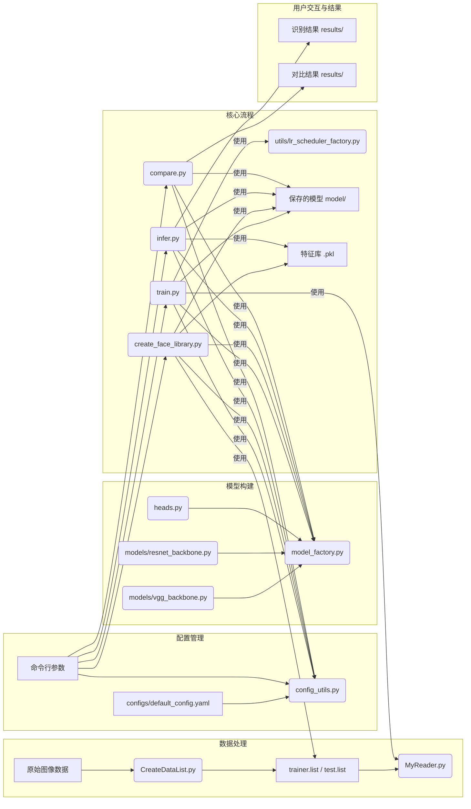

# 基于PaddlePaddle的人脸对比和人脸识别系统

> **重要提示**: 训练和测试时的图像大小**必须保持一致**！模型加载时会优先使用模型文件中保存的图像大小。

本项目基于PaddlePaddle框架实现了人脸对比和人脸识别功能，支持VGG和ResNet作为特征提取器，并集成了ArcFace Loss以提升识别性能。项目参数通过YAML文件集中管理，同时支持通过命令行进行关键参数的指定和覆盖。

## 🚀 快速上手 (Quick Start)

1.  **克隆仓库**:
    ```bash
    git clone https://your-repository-url/Face-Recognition.git # 请替换为您的仓库URL
    cd Face-Recognition
    ```
2.  **创建并激活Python虚拟环境** (推荐):
    ```bash
    python3 -m venv paddle_env
    source paddle_env/bin/activate  # Linux/macOS
    # paddle_env\\Scripts\\activate  # Windows
    ```
    (可选) 参考 [重要环境准备](#️-重要环境准备) 部分的提示配置Shell自动激活环境。
3.  **安装依赖**:
    (推荐使用GPU版本以获得更好性能)
    ```bash
    # 确保 paddle_env 虚拟环境已激活
    # GPU 版本 (示例为CUDA 11.8, 请根据您的CUDA版本和PaddlePaddle官网查找对应安装命令)
    python -m pip install paddlepaddle-gpu==3.0.0 -i https://www.paddlepaddle.org.cn/packages/stable/cu118/
    pip uninstall numpy -y
    pip install numpy==1.26.4 PyYAML opencv-python==4.5.5.64 matplotlib==3.5.3 scikit-learn tqdm
    ```
    (如果无GPU或仅测试，可安装CPU版本)
    ```bash
    # CPU 版本
    # pip install paddlepaddle==2.4.2 # CPU 版本可能也需要调整 numpy
    # pip uninstall numpy -y
    # pip install numpy==1.26.4 PyYAML opencv-python==4.5.5.64 matplotlib==3.5.3 scikit-learn tqdm
    ```
    详细的环境准备和依赖安装说明请参见 [重要环境准备](#️-重要环境准备) 部分。

4.  **准备数据与数据列表**:
    *   按照 [准备数据](#1-准备数据) 的说明组织您的人脸图像数据。
    *   运行脚本生成数据列表：
        ```bash
        # 为默认数据集 (data/face) 生成列表
        # (如果存在旧文件，先手动删除)
        # rm -f data/face/trainer.list data/face/test.list data/face/readme.json
        python CreateDataList.py data/face

        # 为自定义数据集 (例如 data/my_faces) 生成列表
        # python CreateDataList.py data/my_faces
        ```
    **重要**:\
    *   在重新生成列表前，请**手动删除**目标目录下（如 `data/face` 或 `data/my_faces`）已存在的 `trainer.list`, `test.list`, 和 `readme.json` 文件。
    *   `CreateDataList.py` 脚本的参数是**包含所有人物子文件夹的数据集根目录**。

5.  **修改配置**:
    *   打开 `configs/default_config.yaml`。
    *   根据您的数据集修改 `num_classes` (类别数量)。
    *   选择或自定义一个 `active_config` 块 (例如 `resnet_arcface_config`) 并按需调整其参数 (如 `learning_rate`, `epochs`, `batch_size` 等)。详情参阅 [配置管理](#配置管理)。
6.  **执行核心功能示例**:
    *   **模型训练**:
        ```bash
        python train.py --config_path configs/default_config.yaml --use_gpu
        ```
    *   **创建人脸特征库** (如果使用ArcFace模型):
        ```bash
        python create_face_library.py --config_path configs/default_config.yaml --model_path model/face_model_resnet_arcface.pdparams --data_list_file data/face/trainer.list --use_gpu
        # 注意: model_path 应指向您训练好的ArcFace模型
        ```
    *   **人脸识别**:
        ```bash
        python infer.py --config_path configs/default_config.yaml --model_path model/face_model_resnet_arcface.pdparams --image_path data/face/person1/1.jpg --use_gpu
        # 注意: model_path 和 image_path 需要根据实际情况调整
        ```
    *   **人脸对比**:
        ```bash
        python compare.py --config_path configs/default_config.yaml --model_path model/face_model_resnet_arcface.pdparams --img1 data/face/person1/1.jpg --img2 data/face/person2/1.jpg --use_gpu
        # 注意: model_path 和图片路径需要根据实际情况调整
        ```

## ✨ 功能特性 (Core Features)

*   **多种骨干网络**: 支持 **VGG** (定义于 `models/vgg_backbone.py`) 和 **ResNet** (定义于 `models/resnet_backbone.py`, 基于新版PaddlePaddle API) 作为人脸特征提取的骨干网络。
*   **先进损失函数**: 集成 **ArcFace Loss** (主要逻辑封装在 `heads.py` 的 `ArcFaceHead` 中) 以学习高区分度的人脸特征，提升识别精度；同时支持标准的 **CrossEntropy Loss** (对应 `heads.py` 中的 `CrossEntropyHead`)。
*   **灵活模型组合**: 通过 `model_factory.py` 支持 `VGG+CrossEntropyHead`, `ResNet+CrossEntropyHead`, `VGG+ArcFaceHead`, `ResNet+ArcFaceHead` 等多种模型骨干与头部的组合。
*   **全面的训练流程**: 提供完整的模型训练、从检查点继续训练（微调）以及模型评估功能。
*   **人脸识别 (1:N)**:
    *   对于 ArcFace 模型：通过将输入人脸特征与预先构建的特征库进行比对，实现身份识别。
    *   对于 CrossEntropy 模型：通过传统的分类方式进行闭集识别。
*   **人脸对比 (1:1)**: 计算两张人脸图像之间的相似度得分，判断是否为同一人。
*   **特征库管理**: 为 ArcFace 模型提供专门的脚本 (`create_face_library.py`) 用于生成和管理人脸特征库。
*   **强大的配置系统**:
    *   使用 **YAML 文件** (`configs/default_config.yaml`) 集中管理项目的大部分参数（如模型结构、训练超参、路径设置等）。
    *   支持通过**命令行参数**指定核心输入并覆盖YAML配置，方便快速实验和调整。
*   **数据增强**: 训练时支持随机翻转、亮度对比度调整等数据增强策略，提高模型泛化能力。
*   **清晰的项目结构**: 模块化设计，易于理解、维护和扩展。
*   **云服务器自动训练**: 提供自动化训练脚本，支持在云服务器上持续训练和参数调整。

## 📑 目录

<details>
<summary>点击展开/折叠详细目录</summary>

- [🚀 快速上手 (Quick Start)](#-快速上手-quick-start)
- [✨ 功能特性 (Core Features)](#-功能特性-core-features)
- [项目架构与技术栈](#项目架构与技术栈)
  - [模块依赖图 (概念)](#模块依赖图-概念)
  - [核心技术栈](#核心技术栈)
- [项目结构说明](#项目结构说明)
- [⚠️ 重要环境准备](#️-重要环境准备)
  - [1. 进入项目根目录](#1-进入项目根目录)
  - [2. 激活Python虚拟环境 (及自动激活提示)](#2-激活python虚拟环境-及自动激活提示)
  - [3. GPU用户环境变量设置](#3-gpu用户环境变量设置-重要)
  - [4. 安装依赖](#4-安装依赖)
- [⚙️ 配置管理](#️-配置管理)
  - [YAML配置文件概览 (`configs/default_config.yaml`)](#yaml配置文件概览-configsdefault_configyaml)
    - [全局设置 (`global_settings`)](#全局设置-global_settings)
    - [活动配置选择 (`active_config`)](#活动配置选择-active_config)
    - [具体配置块示例 (如 `resnet_arcface_config`)](#具体配置块示例-如-resnet_arcface_config)
    - [学习率调度器配置 (`lr_scheduler_type`, `lr_scheduler_params`)](#学习率调度器配置-lr_scheduler_type-lr_scheduler_params)
  - [命令行参数与覆盖规则](#命令行参数与覆盖规则)
  - [配置加载工具 (`config_utils.py`)](#配置加载工具-config_utilspy)
- [📖 详细使用指南](#-详细使用指南)
  - [**1. 准备数据**](#1-准备数据)
  - [**2. 创建数据列表 (`CreateDataList.py`)**](#2-创建数据列表-createdatalistpy)
    - [功能简介](#功能简介)
    - [命令示例](#命令示例)
    - [重要提示](#重要提示)
  - [**3. 模型训练 (`train.py`)**](#3-模型训练-trainpy)
    - [功能简介](#功能简介-1)
    - [核心参数配置](#核心参数配置)
    - [初始训练](#初始训练)
    - [继续训练（模型微调）](#继续训练模型微调)
    - [训练输出解读](#训练输出解读)
  - [**4. 创建人脸特征库 (针对ArcFace模型, `create_face_library.py`)**](#4-创建人脸特征库-针对arcface模型-create_face_librarypy)
    - [功能简介与原理](#功能简介与原理)
    - [核心参数配置](#核心参数配置-1)
    - [命令示例](#命令示例-1)
    - [输出解读](#输出解读-1)
  - [**5. 人脸识别测试 (`infer.py`)**](#5-人脸识别测试-inferpy)
    - [功能简介](#功能简介-2)
    - [核心参数配置](#核心参数配置-2)
    - [命令示例 (ArcFace模型)](#命令示例-arcface模型)
    - [命令示例 (CrossEntropy模型)](#命令示例-crossentropymodel)
    - [输出解读与可视化](#输出解读与可视化)
  - [**6. 人脸对比测试 (`compare.py`)**](#6-人脸对比测试-comparepy)
    - [功能简介](#功能简介-3)
    - [核心参数配置](#核心参数配置-3)
    - [命令示例](#命令示例-2)
    - [输出解读与可视化](#输出解读与可视化-1)
  - [**7. 更换数据集流程**](#7-更换数据集流程)
- [🛠️ 模型调优指南](#️-模型调优指南)
  - [参数调整示例](#参数调整示例)
  - [可调参数概览](#可调参数概览)
- [❓ 常见问题解决 (FAQ)](#-常见问题解决-faq)
  - [环境与安装问题](#环境与安装问题)
  - [数据准备问题](#数据准备问题)
  - [训练过程问题](#训练过程问题)
  - [ArcFace 相关问题](#arcface-相关问题)
  - [推理与对比问题](#推理与对比问题)
  - [性能问题 (准确率、速度、内存)](#性能问题-准确率速度内存)
- [📊 参数调整效果分析 (简要)](#-参数调整效果分析-简要)
- [💡 技术实现细节](#-技术实现细节)
- [📝 注意事项](#-注意事项)
- [🚀 项目提升和优化目标](#-项目提升和优化目标)
  - [核心目标 (已完成/进行中)](#核心目标-已完成进行中)
  - [可选进阶目标](#可选进阶目标)

</details>

## 项目架构与技术栈

### 模块依赖图 (概念)


*(这是一个简化的概念图，展示了主要模块和数据流。)*

### 核心技术栈

*   **核心框架**: PaddlePaddle (本项目基于 `paddlepaddle-gpu==3.0.0` 测试，旧版 `v2.4.2` 也曾支持)
*   **编程语言**: Python (3.8+)
*   **主要依赖**:
    *   `PyYAML`: 用于解析YAML配置文件。
    *   `opencv-python`: 用于图像读取和预处理。
    *   `matplotlib`: 用于结果可视化。
    *   `scikit-learn`: (可能用于评估指标，或辅助数据处理)。
    *   `tqdm`: 用于显示进度条。
    *   `numpy`: 数值计算基础库。

## 项目结构说明
(原项目结构基本不变，这里的文字可以稍微调整，使其更符合当前的模块化描述)
```
Face-Recognition/
├── configs/                  # 配置目录
│   └── default_config.yaml   # 默认YAML配置文件 (包含多种预设模式)
├── data/                     # 数据目录 (示例: data/face)
│   └── face/                 # 示例人脸数据集
├── model/                    # 模型保存目录 (由配置文件中 model_save_dir 指定)
├── models/                   # 存放骨干网络定义的模块
│   ├── vgg_backbone.py       # VGG骨干网络定义
│   └── resnet_backbone.py    # ResNet骨干网络定义
├── heads.py                  # 存放模型头部定义 (如ArcFaceHead, CrossEntropyHead)
├── utils/                    # 存放工具/辅助模块
│   └── lr_scheduler_factory.py # 学习率调度器工厂
├── results/                  # 推理和对比结果图片保存目录
├── CreateDataList.py         # 创建数据列表脚本
├── MyReader.py               # 图像读取和预处理模块
├── config_utils.py           # 配置加载与合并工具模块
├── train.py                  # 模型训练脚本
├── create_face_library.py    # 创建人脸特征库脚本 (用于ArcFace模型推理)
├── infer.py                  # 人脸识别预测脚本
├── compare.py                # 人脸对比工具脚本
└── README.md                 # 项目说明文档 (本文档)
```
*注：旧版 `resnet.py` (以及可能的中间版本如 `resnet_new.py`) 已被 `models/resnet_backbone.py` (基于新版PaddlePaddle API) 完全替代。ArcFace Loss 等损失相关逻辑主要封装在 `heads.py` (例如 `ArcFaceHead` 定义了ArcFace损失的计算方式) 中，并在 `train.py` 中于训练时调用。骨干网络和头部的实例化则由 `model_factory.py` 根据配置统一管理。*

## ⚠️ 重要环境准备

在开始之前，请确保您已完成以下环境设置：

### 1. 进入项目根目录
所有后续命令都应在克隆本仓库后的 `Face-Recognition` 目录下执行。
    ```bash
    cd path/to/Face-Recognition
    ```

### 2. 激活Python虚拟环境 (及自动激活提示)
本项目推荐使用名为 `paddle_env` 的虚拟环境。如果尚未创建，请先创建它。
    ```bash
    # 如果是第一次，创建虚拟环境 (python3 -m venv paddle_env)
source paddle_env/bin/activate # Linux/macOS
# paddle_env\Scripts\activate # Windows
    ```
    **提示**: 你可以将以下代码块添加到你的 `~/.bashrc` (或 `~/.zshrc` 等) 文件末尾，以实现当你 `cd` 进入 `Face-Recognition` 目录时自动激活 `paddle_env` 虚拟环境，并在离开时自动停用：
    ```bash
    # Auto-activate/deactivate paddle_env for Face-Recognition project
    auto_activate_paddle_env() {
        if [ -d "paddle_env" ] && [ -f "paddle_env/bin/activate" ]; then
            if [[ "$PWD" == *"/Face-Recognition"* ]] && [[ "$VIRTUAL_ENV" != "$PWD/paddle_env" ]]; then
                echo "Activating paddle_env in $PWD..."
                source "paddle_env/bin/activate"
            elif [[ "$VIRTUAL_ENV" == "$PWD/paddle_env" ]] && [[ "$PWD" != *"/Face-Recognition"* ]]; then
                echo "Deactivating paddle_env..."
                deactivate
            fi
        # If navigating out of a subdir of Face-Recognition but still within project, and env is active, keep it.
        elif [[ "$VIRTUAL_ENV" == */Face-Recognition/paddle_env* ]] && [[ "$PWD" != *"/Face-Recognition"* ]]; then
             # Check if we are in a parent directory that is NOT Face-Recognition
            if [[ "$VIRTUAL_ENV" != "$PWD/paddle_env" ]]; then
                 # Check if we are not in a subdirectory of where the virtual env is defined
                if [[ "$PWD"* != "$(dirname "$VIRTUAL_ENV")"*  ]]; then
                    echo "Deactivating paddle_env as we left the project root..."
                    deactivate
                fi
            fi
        fi
    }
    # Run on every prompt
    export PROMPT_COMMAND="auto_activate_paddle_env;$PROMPT_COMMAND"
    # Initial check in case .bashrc is sourced while already in the directory
    auto_activate_paddle_env
    ```
    保存 `~/.bashrc` 后，运行 `source ~/.bashrc` 使其生效。

### 3. GPU用户环境变量设置 (重要)
如果您计划使用GPU进行训练或推理，请在您的终端会话中设置以下环境变量。将这些命令添加到您的 `~/.bashrc` 或 `~/.zshrc` 文件中可以使其永久生效。
    ```bash
    # 根据您的CUDA实际安装路径调整
    export CUDA_HOME=/usr/local/cuda
    # 对于WSL用户，可能需要包含 /usr/lib/wsl/lib
    export LD_LIBRARY_PATH=$LD_LIBRARY_PATH:$CUDA_HOME/lib64:/usr/lib/wsl/lib
    ```
    运行 `source ~/.bashrc` (或对应的shell配置文件) 使更改生效。

### 4. 安装依赖
    本项目使用 `tqdm` 库显示进度条，请确保安装。
对于GPU版本 (推荐，示例为CUDA 11.8，请根据你的CUDA版本查找对应安装命令):
    ```bash
    # 确保 paddle_env 虚拟环境已激活
    python -m pip install paddlepaddle-gpu==3.0.0 -i https://www.paddlepaddle.org.cn/packages/stable/cu118/
    # 安装固定版本的 numpy (非常重要，防止 ABI 冲突)
    pip uninstall numpy -y
    pip install numpy==1.26.4
    # 安装其他依赖
    pip install PyYAML opencv-python==4.5.5.64 matplotlib==3.5.3 scikit-learn tqdm
    ```
对于CPU版本:
    ```bash
    # 确保 paddle_env 虚拟环境已激活
    pip install paddlepaddle==2.4.2 # CPU 版本可能也需要调整 numpy
    pip uninstall numpy -y
    pip install numpy==1.26.4
    pip install PyYAML opencv-python==4.5.5.64 matplotlib==3.5.3 scikit-learn tqdm
    ```
    > **兼容性提示**: 如果遇到 `numpy` ABI 错误或与PaddlePaddle版本不兼容，请查阅PaddlePaddle官方文档获取推荐的 `numpy` 版本，或尝试让 `pip` 自动解析依赖后，若仍有问题再指定版本。

## ⚙️ 配置管理

本项目采用YAML文件结合命令行参数的方式进行配置管理，由 `config_utils.py` 模块实现加载和合并逻辑。这种方式提供了高度的灵活性，方便用户进行实验和参数调整。

### YAML配置文件概览 (`configs/default_config.yaml`)
主要的配置文件位于 `configs/default_config.yaml`。它采用分层结构，包含了项目运行所需的绝大多数参数。

#### 全局设置 (`global_settings`)
这部分参数作为基础配置被首先加载，适用于所有模式。如果活动配置块中定义了同名参数，则活动配置块中的值会覆盖全局设置。
```yaml
# configs/default_config.yaml (部分示例)
# --- 全局设置 ---
use_gpu: true         # 是否使用GPU。命令行 --use_gpu / --no-use_gpu 可覆盖。
seed: 42              # 随机种子，用于实验复现。
image_size: 64        # 图像预处理后的统一尺寸 (H和W)。训练、评估、推理时必须一致。
                      # 模型加载时会优先使用模型文件中保存的 image_size。
data_dir: 'data'      # 数据集根目录。
class_name: 'face'    # 当前使用的数据集子目录名 (位于 data_dir 下)。
model_save_dir: 'model' # 训练好的模型及检查点保存目录。
num_classes: 5        # 数据集中的总身份类别数。**重要**: 必须根据实际数据集修改!
log_interval: 10      # 训练时，每多少个batch打印一次日志。
resume: null          # 是否从检查点恢复训练。
                      # null: 检查点存在则自动恢复，不存在则从头开始。
                      # true: 强制从检查点恢复 (若不存在则报错或从头开始，取决于脚本实现)。
                      # false: 强制从头开始训练，即使检查点存在。
                      # 命令行参数 --resume / --no-resume 具有最高优先级。
```
**用途说明**:
*   `use_gpu`: 控制是否使用GPU加速。
*   `seed`: 保证实验的可复现性。
*   `image_size`: 影响数据预处理和模型输入层。
*   `data_dir`, `class_name`: 定位数据集。
*   `model_save_dir`: 决定模型和检查点保存位置。
*   `num_classes`: 对模型头部定义和损失计算至关重要。
*   `log_interval`: 控制训练日志的输出频率。
*   `resume`: 控制训练是否从之前的状态继续。

#### 活动配置选择 (`active_config`)
通过修改 `active_config` 的值，可以选择加载 `configs/default_config.yaml` 文件中定义的特定配置块。
```yaml
# --- 活动配置选择 ---
active_config: 'resnet_arcface_config'
# 可选项: 'vgg_ce_config', 'vgg_arcface_config', 'resnet_ce_config', 'resnet_arcface_config', 或您自定义的配置块名
```
脚本会加载与 `active_config` 名称相匹配的配置块，并将其参数深层合并到全局设置中。

#### 具体配置块示例 (如 `resnet_arcface_config`)
每个配置块针对一种特定的模型和损失函数组合（或其他实验设置），包含更细致的参数。
以下展示 `resnet_arcface_config` 的一个完整示例：
```yaml
# --- ResNet + ArcFace 配置块 ---
resnet_arcface_config:
  # --- 模型类型和损失函数 (关键，代码根据此判断加载逻辑) ---
  model_type: 'resnet'    # 可选: 'vgg', 'resnet'
  loss_type: 'arcface'    # 可选: 'cross_entropy', 'arcface'

  # --- ResNet 骨干网络参数 ---
  model: # 嵌套一层 'model' 是为了将来可能支持更复杂的模型组合
    resnet_params:
      feature_dim: 512  # ResNet最终输出的特征向量维度
      nf: 32            # ResNet初始卷积层的输出通道数 (filter数量)
      n_resnet_blocks: 3 # 每个ResNet stage中残差块的数量 (对应ResNet-18/34的配置方式)

  # --- ArcFace Loss 特定参数 ---
  loss: # 嵌套一层 'loss'
    arcface_params:
      arcface_m1: 1.0   # ArcFace的m1参数 (PaddlePaddle API参数)
      arcface_m2: 0.5   # ArcFace的角度间隔m (margin)
      arcface_m3: 0.0   # ArcFace的m3参数 (PaddlePaddle API参数)
      arcface_s: 64.0   # ArcFace的尺度因子s (scale)

  # --- 训练超参数 (会覆盖全局设置中的同名参数) ---
batch_size: 32
  epochs: 120             # 训练的总轮数。如需从检查点继续训练，应确保此值大于已训练轮数。
  learning_rate: 0.001    # 优化器的初始学习率
  optimizer_type: 'AdamW' # 优化器类型, 可选: 'Momentum', 'AdamW'
  optimizer_params:       # 优化器特定参数
    weight_decay: 0.0001
    # momentum: 0.9 # (如果 optimizer_type: 'Momentum')

  # --- 学习率调度器配置 (详细说明见下一节) ---
  lr_scheduler_type: 'CosineAnnealingDecay'
  lr_scheduler_params:
    warmup:
      use_warmup: false
      warmup_steps: 500   # 若启用，表示Warmup的总步数 (batch数)
      start_lr: 0.00001 # Warmup起始学习率
    cosine_annealing:
      T_max: 120        # CosineAnnealingDecay的总epochs数, 通常等于训练总epochs
      eta_min: 0.0      # 最小学习率
    # ... (reduce_lr_on_plateau 和 cosine_annealing_warm_restarts 的参数，如果选用)

  # --- 推理、对比、建库时的特定参数 (会传递给相应脚本) ---
  infer: # infer.py 使用
    face_library_path: 'model/face_library_resnet_arcface.pkl' # ArcFace模型识别时依赖的特征库
    recognition_threshold: 0.5  # ArcFace识别时的相似度阈值
    label_file: 'data/face/readme.json' # 标签ID到名称的映射文件
    infer_visualize: true       # 推理时是否可视化结果
  compare: # face_compare.py 使用
    compare_threshold: 0.8      # 人脸对比时判断为同一人的相似度阈值
    compare_visualize: true     # 对比时是否可视化结果并保存图片
  create_library: # create_face_library.py 使用
    output_library_path: 'model/face_library_resnet_arcface.pkl' # 生成的特征库保存路径
```
**强烈建议**：用户根据自己的需求复制 `default_config.yaml` 并重命名（例如 `my_experiment.yaml`），然后修改其中的参数值，再通过 `--config_path my_experiment.yaml` 来加载。或者，直接修改 `default_config.yaml` 中的 `active_config` 和相应的配置块参数。

#### 学习率调度器配置 (`lr_scheduler_type`, `lr_scheduler_params`)
项目支持多种学习率调度策略，通过 `lr_scheduler_type` 选择基础调度器，并通过 `lr_scheduler_params` 配置其参数及可选的Warmup。

*   `lr_scheduler_type`: 支持以下类型：
    *   `'CosineAnnealingDecay'`: 余弦退火。参数在 `lr_scheduler_params.cosine_annealing` 下配置。
    *   `'ReduceLROnPlateau'`: 当监控指标停止改进时降低学习率。参数在 `lr_scheduler_params.reduce_lr_on_plateau` 下配置。
    *   `'CosineAnnealingWarmRestarts'`: 带热重启的余弦退火。参数在 `lr_scheduler_params.cosine_annealing_warm_restarts` 下配置。
*   `lr_scheduler_params`:
    *   `warmup`:
        *   `use_warmup: true/false`: 是否启用Warmup。
        *   `warmup_steps`: Warmup进行的**步数（batch数）**。
        *   `start_lr`: Warmup开始时的学习率。
    *   各调度器参数（如 `cosine_annealing.T_max`, `reduce_lr_on_plateau.patience` 等）。

**示例结构 (来自 `configs/default_config.yaml`):**
```yaml
# ... 其他配置 ...
lr_scheduler_type: 'CosineAnnealingDecay' # 或 'ReduceLROnPlateau', 'CosineAnnealingWarmRestarts'

lr_scheduler_params:
  cosine_annealing:
    T_max: 120        # 通常等于总epochs数 (for CosineAnnealingDecay)
    eta_min: 0.0      # 最小学习率
    # verbose: False
  reduce_lr_on_plateau:
    mode: 'min'       # 'min' for loss, 'max' for accuracy
    factor: 0.1       # new_lr = lr * factor
    patience: 10      # epochs to wait for improvement
    threshold: 0.0001
    metric_name: 'loss' # 监控的验证集指标名: 'loss' 或 'acc'
    # verbose: True
  cosine_annealing_warm_restarts:
    T_0: 50           # 首次重启的周期 (epochs or steps)
    T_mult: 1         # 周期乘数
    eta_min: 0.0
    # verbose: False
  warmup:
    use_warmup: true
    warmup_steps: 500 # 假设5个epoch, 每个epoch 100个batch (5 * 100 = 500 steps)
    start_lr: 0.00001 # Warmup起始学习率
    # verbose: True
# ... 其他配置 ...
```
**场景化配置建议**:
*   **快速收敛并平稳下降**: `lr_scheduler_type: 'CosineAnnealingDecay'`，设置 `T_max` 为总训练epochs。可选配合 `warmup`。
*   **根据验证集性能自动调整**: `lr_scheduler_type: 'ReduceLROnPlateau'`，设置 `metric_name` (通常为 `'loss'` 或 `'acc'`) 和 `patience`。
*   **周期性重启学习率**: `lr_scheduler_type: 'CosineAnnealingWarmRestarts'`，配置 `T_0` 和 `T_mult`。

请确保根据您的训练计划（总epochs、batch数量等）合理设置这些参数。`ReduceLROnPlateau` 的 `step()` 方法通常在每个epoch结束时，基于验证集的性能指标被调用。其他调度器（如`CosineAnnealingDecay`, `CosineAnnealingWarmRestarts`）通常在每个batch后 `step()`。如果启用了Warmup，它会在主调度器之前生效。

### 命令行参数与覆盖规则
-   **核心参数**:
    -   `--config_path <路径>`: 指定要加载的YAML配置文件路径。若不提供，各脚本会尝试加载其内部定义的默认路径（通常是 `configs/default_config.yaml`）。
    -   `--use_gpu` / `--no-use_gpu`: (布尔型开关) 是否使用GPU。
    -   `--resume` / `--no-resume`: (布尔型开关, 仅 `train.py`) 是否从检查点恢复训练。
    -   特定脚本的**必需输入**：
        *   `train.py`: 通常无额外必需命令行参数（依赖YAML）。
        *   `infer.py`: `--model_path <模型路径>` 和 `--image_path <图片路径>`。
        *   `compare.py`: `--model_path <模型路径>`, `--img1 <图片1路径>`, `--img2 <图片2路径>`。
        *   `create_face_library.py`: `--model_path <模型路径>` 和 `--data_list_file <数据列表路径>`。
-   **覆盖参数**: YAML中定义的大多数参数可以通过命令行提供同名参数来进行覆盖。
    -   **命名对应**: 命令行参数的名称通常直接对应于YAML文件中的键名（扁平化）。例如，YAML中的 `learning_rate: 0.001` 可以通过命令行 `--learning_rate 0.0005` 来覆盖。对于嵌套参数，如 `optimizer_params.weight_decay`，目前需要通过修改YAML或在脚本的 `argparse` 中添加对应的扁平化参数（如 `--weight_decay`）并由 `config_utils.py` 正确合并。
    -   **布尔型参数**: 对于YAML中的布尔值，命令行使用 `action=argparse.BooleanOptionalAction` (Python 3.9+), 这意味着 `--param_name` 会设为True, `--no-param_name` 会设为False。例如 `--use_gpu`, `--no-use_gpu`。
-   **优先级**: 命令行参数的优先级 **高于** YAML文件中的参数。

### 配置加载工具 (`config_utils.py`)
该模块包含核心函数 `load_config`，其职责是：
1.  加载用户通过 `--config_path` 指定的YAML文件，或默认的 `default_yaml_path`。
2.  提取YAML中的 `global_settings`。
3.  根据YAML中的 `active_config` 名称，加载对应的配置块。
4.  将活动配置块与全局设置进行**深层合并**。
5.  解析用户在命令行提供的参数 (`cmd_args_namespace`)。
6.  将命令行参数合并到之前合并的YAML配置中，命令行参数具有最高优先级，直接覆盖同名项。
7.  返回一个支持属性访问的 `ConfigObject` 对象。

所有使用配置的脚本（`train.py`, `infer.py`, `create_face_library.py`, `compare.py`）都会在开始时调用 `load_config` 来获取最终生效的配置。

## 📖 详细使用指南

本指南将引导您完成数据准备、模型训练、特征库创建（针对ArcFace模型）、人脸识别和人脸对比的完整流程。

### **1. 准备数据**
将人脸数据放在YAML配置中 `data_dir` 和 `class_name` 指定的目录下（默认为 `data/face`），每个人的照片放在单独的子文件夹中：

```
data/face/  (或 config.data_dir / config.class_name)
├── person1/
│   ├── 1.jpg
│   ├── 2.jpg
│   └── ...
├── person2/
│   ├── 1.jpg
│   ├── 2.jpg
│   └── ...
└── ...
```
**注意事项**：
- 每个人的照片建议不少于20张，角度和光照多样化。
- 图片格式支持jpg、jpeg、png、bmp。
- 建议预先对人脸进行检测和裁剪，保证人脸大致居中，以获得更好效果。

### **2. 创建数据列表 (`CreateDataList.py`)**

#### 功能简介
此脚本会遍历指定的数据集根目录，为其中的图片生成训练列表文件 (`trainer.list`)、测试列表文件 (`test.list`) 以及一个包含类别和数量等信息的元数据文件 (`readme.json`)。列表文件格式为：`图像相对路径\t类别标签ID`。

#### 命令示例
    ```bash
# 为默认数据集 (data/face) 生成列表
# (如果存在旧文件，先手动删除)
    # rm -f data/face/trainer.list data/face/test.list data/face/readme.json
    python CreateDataList.py data/face

# 为自定义数据集 (例如 data/my_faces) 生成列表
# python CreateDataList.py data/my_faces
    ```

#### 重要提示
*   脚本会**覆盖**目标目录下已存在的同名列表文件 (`trainer.list`, `test.list`) 和元数据文件 (`readme.json`)。
*   `CreateDataList.py` 脚本的参数是**包含所有人物子文件夹的数据集根目录**。
*   生成的 `readme.json` 中的 `num_classes` (即 `total_classes`) 需要与您在 `configs/default_config.yaml` 中为训练设置的 `num_classes` **保持一致**。

### **3. 模型训练 (`train.py`)**

#### 功能简介
`train.py` 脚本用于训练人脸识别模型。它支持从头开始训练，或从已保存的检查点继续训练（微调）。训练过程中的关键参数（如模型类型、损失函数、学习率、优化器等）均通过配置文件和命令行参数进行控制。

#### 核心参数配置
训练前，请务必检查并根据您的需求修改配置文件（默认为 `configs/default_config.yaml`）中 `active_config` 所指向的配置块。关键参数包括：
*   `model_type`: `'vgg'` 或 `'resnet'`。
*   `loss_type`: `'cross_entropy'` 或 `'arcface'`。
*   `num_classes`: 必须与您的数据集中的实际类别总数一致（参考 `CreateDataList.py` 生成的 `readme.json` 中的 `total_classes`)。
*   `image_size`: 训练图像的尺寸。
*   `model_save_dir`: 模型和检查点的保存路径。
*   特定于模型和损失的参数：
    *   `model.vgg_params` 或 `model.resnet_params`
    *   `loss.arcface_params` (如果 `loss_type: 'arcface'`)
*   训练超参数：`batch_size`, `epochs`, `learning_rate`, `optimizer_type`, `optimizer_params`, `lr_scheduler_type`, `lr_scheduler_params`。

更多配置详情请参阅 [⚙️ 配置管理](#️-配置管理) 章节。

#### 初始训练
使用以下命令结构开始新的训练：
```bash
python train.py --config_path <您的配置文件.yaml> [--use_gpu]
```
*   确保 `<您的配置文件.yaml>` 中已正确设置上述核心参数。
*   `--use_gpu` (可选): 如果希望使用GPU并已正确配置环境。

**示例：使用默认配置训练 (假设 `configs/default_config.yaml` 已按需修改好)**
```bash
# 确保 Face-Recognition 目录下，虚拟环境已激活，GPU环境变量已设置 (如需)
python train.py --config_path configs/default_config.yaml --use_gpu
```

#### 继续训练（模型微调）
使用 `--resume` 参数（或在配置文件中设置 `resume: true`）可以从最近的检查点 (`checkpoint_<model_type>_<loss_type>.pdparams`) 继续训练。
```bash
python train.py --config_path <您的配置文件.yaml> --resume [--use_gpu] [--learning_rate <新学习率>] [--epochs <新总轮数>]
```
*   脚本会自动加载与配置文件中 `model_type`, `loss_type` 和 `model_save_dir` 对应的检查点。
*   如果希望调整学习率或总轮数，可以在命令行中覆盖。例如，增加 `epochs` 值以继续训练更多轮次。
*   如果检查点中的配置与当前配置（模型类型、损失类型）不兼容，脚本会尝试仅加载权重并重置训练状态。

#### 训练输出解读
训练过程中，终端会定期打印日志，示例如下 (内容和格式可能略有不同):
```
使用 GPU 进行训练
开始训练前的最终配置确认 (来自YAML并由命令行更新后):
--- 生效的配置项 ---
... (详细配置列表) ...
--------------------
骨干网络 (RESNET) 加载成功，输出特征维度: 512
头部模块 (ARCFACE) 加载成功，输入特征维度: 512, 输出类别数: 5
使用优化器: AdamW，初始学习率: 0.001, WeightDecay: 0.0001
[LR Scheduler Factory] 使用 CosineAnnealingDecay。T_max: 120, eta_min: 0.0
[LR Scheduler Factory] Warmup未启用 (use_warmup=False)。
检查点文件 model/checkpoint_resnet_arcface.pdparams 不存在。将从头开始训练。
将从 epoch 0，best_acc 0.0 开始新的训练。
开始训练，总共 120 个 epochs... 从 epoch 0 开始
--- Epoch 1/120 ---
  Batch 0/15, Loss: 3.4512, Train Acc (batch): 0.0938, LR: 0.001000
  Batch 10/15, Loss: 2.8765, Train Acc (batch): 0.1875, LR: 0.000998
...
Epoch 1 Training Summary: Avg Loss: 2.9876, Avg Acc: 0.2150
Epoch 1 Test Summary: Accuracy: 0.2500, Avg Val Loss: 2.8500
检查点已保存到: model/checkpoint_resnet_arcface.pdparams
最佳模型已更新并保存到: model/face_model_resnet_arcface.pdparams (Epoch 1, Accuracy: 0.2500)
--- Epoch 2/120 ---
...
```
**关键信息**:
*   **生效配置**: 确认加载的参数是否符合预期。
*   **模型与优化器信息**: 确认模型组件、优化器和学习率调度器是否正确初始化。
*   **检查点状态**: 是否从检查点恢复或从头开始。
*   `Loss`: 当前批次的损失值。
*   `Train Acc (batch)`: 到当前批次为止的训练累积准确率。
*   `LR`: 当前学习率。
*   `Epoch Training Summary`: 该轮次在训练集上的平均损失和平均准确率。
*   `Epoch Test Summary`: 该轮次在测试集（验证集）上的准确率和平均损失。
*   **模型保存信息**: 检查点和最佳模型的保存路径及对应的准确率。

**模型文件说明**:
*   **检查点 (Checkpoint)**: 训练过程中，每个epoch结束后会保存一个检查点文件到配置文件中 `model_save_dir` 指定的目录，命名格式如 `checkpoint_<model_type>_<loss_type>.pdparams` (例如 `checkpoint_resnet_arcface.pdparams`)。此文件包含模型权重、优化器状态、学习率调度器状态、当前epoch、最佳准确率以及训练时的完整配置 (`config`)。这使得恢复训练和模型溯源更为方便。
*   **最佳模型 (Best Model)**: 如果当前epoch在测试集上的准确率优于之前所有epoch，则会将当前模型的状态（模型权重和训练配置）保存为最佳模型，文件名格式如 `face_model_<model_type>_<loss_type>.pdparams` (例如 `face_model_resnet_arcface.pdparams`)，也位于 `model_save_dir`。后续推理和对比通常使用此最佳模型。

### **4. 创建人脸特征库 (针对ArcFace模型, `create_face_library.py`)**

#### 功能简介与原理
如果模型使用 ArcFace Loss 训练 (即配置文件中 `loss_type: 'arcface'`)，您需要为已知的身份创建一个特征库。后续 `infer.py` 在进行识别时会使用这个库进行1:N比对。
1.  **特征提取**: 对于数据列表（通常是训练列表 `trainer.list`）中的每张图像，使用训练好的骨干网络提取其高维特征向量。
2.  **特征聚合**: 对于每个身份（标签），将其所有图像的特征向量进行**平均**，得到该身份的一个代表性特征向量。
3.  **特征库构建**: 将所有身份的代表性特征向量及其对应的标签ID存储起来，形成人脸特征库，通常保存为pickle文件 (`.pkl`)。

#### 核心参数配置
运行此脚本前，请检查配置文件中的以下参数（通常在 `active_config` 下的 `create_library` 块中指定，或通过命令行覆盖）：
*   `output_library_path`: 生成的特征库的保存路径 (例如 `model/face_library_resnet_arcface.pkl`)。
*   `image_size`: 必须与训练模型时使用的 `image_size` 一致 (脚本会优先尝试从模型文件中读取此配置)。

命令行必需参数：
*   `--model_path`: **必需**，指向训练好的、包含ArcFace的模型文件 (例如 `model/face_model_resnet_arcface.pdparams`)。
*   `--data_list_file`: **必需**，包含图像路径和标签的数据列表文件 (例如 `data/face/trainer.list`)，用于从中提取特征并构建库。

#### 命令示例
```bash
python create_face_library.py \
    --config_path <您的配置文件.yaml> \
    --model_path <训练好的ArcFace模型.pdparams路径> \
    --data_list_file <数据集列表文件路径> \
    [--use_gpu]
```
**示例**:
```bash
python create_face_library.py \
    --config_path configs/default_config.yaml \
    --model_path model/face_model_resnet_arcface.pdparams \
    --data_list_file data/face/trainer.list \
    --use_gpu
```

#### 输出解读
```
使用 GPU 进行特征提取
从 model/face_model_resnet_arcface.pdparams 加载模型...
RESNET 骨干网络加载并设置到评估模式成功。
将使用图像大小: 64x64
开始从 480 张图像中提取特征...
提取特征: 100%|██████████| 480/480 [00:10<00:00, 47.50it/s]
计算每个类别的平均特征向量...
计算平均特征: 100%|██████████| 5/5 [00:00<00:00, 1520.23it/s]
创建输出目录: model (如果model_save_dir配置的目录不存在)
人脸特征库已成功保存到: model/face_library_resnet_arcface.pkl
库中包含 5 个身份的特征。
```
*   确认使用了正确的设备 (GPU/CPU) 和模型文件。
*   `提取特征` 和 `计算平均特征` 的进度条显示处理进度。
*   最终输出特征库的保存路径和库中包含的身份数量。

### **5. 人脸识别测试 (`infer.py`)**

#### 功能简介
使用 `infer.py` 对单张人脸图像进行身份识别。
*   对于 **ArcFace** 模型，它会将输入图像的特征与特征库中的特征进行比对，找出最相似的身份。
*   对于 **CrossEntropy** 模型，它会直接输出分类概率最高的身份。

#### 核心参数配置
运行此脚本前，请检查配置文件中的以下参数（通常在 `active_config` 下的 `infer` 块中指定，或通过命令行覆盖）：
*   `model_type`, `loss_type`: (从模型文件中自动加载，但配置文件中可作为校验或备用)
*   `image_size`: (优先从模型文件加载)
*   `label_file`: (必需) 指向 `CreateDataList.py` 生成的 `readme.json` 文件，用于将预测的类别ID映射为具体的人物名称。
*   `infer_visualize`: 是否将识别结果标注在图像上并保存。
*   **ArcFace 模型专属**:
    *   `face_library_path`: (必需) 指向 `create_face_library.py` 生成的 `.pkl` 特征库文件。
    *   `recognition_threshold`: 识别阈值，只有当最高相似度超过此阈值时，才认为是有效识别。
命令行必需参数：
*   `--model_path`: **必需**，指向训练好的模型文件。
*   `--image_path`: **必需**，指向待识别的人脸图像。

#### 命令示例 (ArcFace模型)
```bash
python infer.py \
    --config_path <您的配置文件.yaml> \
    --model_path <训练好的ArcFace模型.pdparams路径> \
    --image_path <您的测试图片路径.jpg> \
    [--use_gpu]
```
**示例**:
```bash
python infer.py \
    --config_path configs/default_config.yaml \
    --model_path model/face_model_resnet_arcface.pdparams \
    --image_path data/face/person3/some_image.jpg \
    --use_gpu
```

#### 命令示例 (CrossEntropy模型)
```bash
python infer.py \
    --config_path <您的配置文件.yaml> \
    --model_path <训练好的CE模型.pdparams路径> \
    --image_path <您的测试图片路径.jpg> \
    [--use_gpu]
```
**示例**:
```bash
# 假设 configs/default_config.yaml 的 active_config 指向一个 vgg_ce_config 或 resnet_ce_config
# 并且该配置块下的 infer.face_library_path 为空或不影响CE模型
python infer.py \
    --config_path configs/default_config.yaml \
    --model_path model/face_model_vgg_ce.pdparams \
    --image_path data/face/person3/some_image.jpg \
    --use_gpu
```

#### 输出解读与可视化
**ArcFace 模型终端输出示例**:
```
使用 GPU 进行推理
从 model/face_model_resnet_arcface.pdparams 加载模型...
RESNET 骨干网络权重从 'backbone' 键加载成功。
提示: 模型损失类型为 ArcFace。在推理时，将仅使用骨干网络提取特征，并与特征库比对。不直接实例化ArcFaceHead进行前向计算。
标签文件 data/face/readme.json 加载成功。
人脸特征库 model/face_library_resnet_arcface.pkl 加载成功，包含 5 个已知身份。
开始推理图像: data/face/person3/some_image.jpg 使用模型: model/face_model_resnet_arcface.pdparams
RESNET+ARCFACE 特征比对完成。
预测的人脸类别 (基于特征库): person3, 最高相似度: 0.8567
结果图像已保存至: results/recognition_resnet_arcface_some_image.jpg
```
*   如果相似度低于配置文件中 `infer.recognition_threshold`，可能会输出 "未知人物"。

**CrossEntropy 模型终端输出示例**:
```
使用 CPU 进行推理
从 model/face_model_vgg_ce.pdparams 加载模型...
VGG 骨干网络权重从 'backbone' 键加载成功。
头部模块 (CROSS_ENTROPY) 实例化成功。
头部模块 (CrossEntropyHead) 权重加载成功。
标签文件 data/face/readme.json 加载成功。
开始推理图像: data/face/person3/some_image.jpg 使用模型: model/face_model_vgg_ce.pdparams
VGG+CROSS_ENTROPY 分类完成。
预测的人脸类别 (基于分类): person3, 置信度: 0.9876
结果图像已保存至: results/recognition_vgg_cross_entropy_some_image.jpg
```

**可视化结果**: 如果配置文件中的 `infer.infer_visualize` 或命令行的 `--infer_visualize` 被设置为启用可视化，脚本会将识别结果（预测的类别名和置信度/相似度）标注在输入图像上，并保存到 `results/` 目录下。文件名通常包含模型类型、损失类型和原图文件名。

### **6. 人脸对比测试 (`compare.py`)**

#### 功能简介
使用 `compare.py` 对比两张人脸图像，计算它们之间的特征相似度，并判断是否为同一个人。

#### 核心参数配置
运行此脚本前，请检查配置文件中的以下参数（通常在 `active_config` 下的 `compare` 块中指定，或通过命令行覆盖）：
*   `image_size`: (优先从模型文件加载)
*   `compare_visualize`: 是否将对比结果并排显示并保存。
*   `compare_threshold`: 判断两张图片是否为同一人的相似度阈值。

命令行必需参数：
*   `--model_path`: **必需**，指向训练好的模型文件。骨干网络部分将被用于提取特征。
*   `--img1`: **必需**，第一张待对比的人脸图像路径。
*   `--img2`: **必需**，第二张待对比的人脸图像路径。

#### 命令示例
```bash
python compare.py \
    --config_path <您的配置文件.yaml> \
    --model_path <训练好的模型.pdparams路径> \
    --img1 <第一张人脸图像路径.jpg> \
    --img2 <第二张人脸图像路径.jpg> \
    [--use_gpu]
```
**示例**:
```bash
python compare.py \
    --config_path configs/default_config.yaml \
    --model_path model/face_model_resnet_arcface.pdparams \
    --img1 data/face/person1/img1.jpg \
    --img2 data/face/person1/img2.jpg \
    --use_gpu
```

#### 输出解读与可视化
**终端输出示例**:
```
使用 GPU 进行人脸对比
从 model/face_model_resnet_arcface.pdparams 加载模型...
RESNET 骨干网络加载并设置到评估模式成功。
开始对比图像:
1. data/face/person1/img1.jpg
2. data/face/person1/img2.jpg
图像1: data/face/person1/img1.jpg
图像2: data/face/person1/img2.jpg
使用模型类型: RESNET, 损失类型 (来自配置): ARCFACE
计算得到的相似度: 0.9123
判断结果 (阈值 0.8): 是同一个人
对比结果图像已保存至: results/compare_resnet_arcface_img1_vs_img2.png
```

**可视化结果**: 如果配置文件中的 `compare.compare_visualize` 或命令行的 `--compare_visualize` 被设置为启用可视化，脚本会并排显示两张输入图像，并在标题处标注计算出的相似度、判断结果（是否为同一个人）和使用的阈值。图像会保存到 `results/` 目录。

### **7. 更换数据集流程**
1.  **准备新数据集**: 按照 [1. 准备数据](#1-准备数据) 的说明，创建新数据目录并按人物子文件夹组织图像。假设新数据集路径为 `data/new_dataset_name`。
2.  **创建数据列表**: 运行 `python CreateDataList.py data/new_dataset_name`。这会在 `data/new_dataset_name/` 目录下生成 `trainer.list`, `test.list`, 和 `readme.json`。记下 `readme.json` 中的 `total_classes` 值。
3.  **配置YAML文件**:
    *   建议：复制 `configs/default_config.yaml` 为例如 `configs/new_dataset_config.yaml`。
    *   修改 `configs/new_dataset_config.yaml`：
        *   将 `active_config` 指向一个您希望用于新数据集训练的配置块 (或者新建一个配置块)。
        *   在**全局设置** (`global_settings`) 或您选定的**活动配置块**中，更新以下参数以适应新数据集：
            *   `data_dir`: (如果新数据集不在原 `data_dir` 下，则修改)
            *   `class_name`: 新数据集的子目录名 (例如 `new_dataset_name`)。
            *   `num_classes`: **必须更新为新数据集的实际类别总数** (来自 `readme.json`)。
            *   `model_save_dir`: (可选) 为新模型指定一个新的保存目录 (例如 `model_new_dataset`)，以避免覆盖旧模型。
            *   (针对 `infer`, `compare`, `create_library` 配置块) 更新相关的 `label_file`, `face_library_path`, `output_library_path` 以指向新数据集的相关文件和期望路径。
        *   根据需要调整其他训练参数（学习率、epochs等）。
4.  **开始新数据集训练**:
    ```bash
    python train.py --config_path configs/new_dataset_config.yaml [--use_gpu]
    ```
    如果需要迁移学习 (加载旧模型的骨干权重)，目前脚本未直接支持此功能，需要手动修改`train.py`的权重加载逻辑，或者确保预训练模型的骨干网络与新任务兼容（主要关注特征提取部分）。

## 🛠️ 模型调优指南

为了提高模型准确率，您可以通过修改YAML配置文件中的参数，或通过命令行临时覆盖来进行实验。

### 参数调整示例
**调整学习率**:
1.  **通过YAML**: 修改您的配置文件 (例如 `configs/default_config.yaml` 中 `active_config` 指向的块) 内的 `learning_rate` 值。
    ```yaml
    # 在resnet_arcface_config块中
    learning_rate: 0.0005 # 将原来的0.001改为0.0005
    ```
2.  **通过命令行 (临时覆盖)**:
    ```bash
    python train.py --config_path configs/default_config.yaml --learning_rate 0.0005 --use_gpu
    ```
    这种方式会临时将该次训练的学习率设为 `0.0005`，而不会修改YAML文件。

### 可调参数概览
以下是一些关键的可调参数及其可能的影响，请参考 `configs/default_config.yaml` 中各参数的注释和 [⚙️ 配置管理](#️-配置管理) 章节获取更详细说明：

*   **通用训练参数**:
    *   `learning_rate`: 学习率，过高可能导致不收敛，过低可能收敛慢或陷入局部最优。
    *   `batch_size`: 批大小，影响梯度估计的准确性和内存消耗。较大batch通常配合较大学习率。
    *   `epochs`: 训练轮数。
    *   `optimizer_type`: `AdamW` 通常具有较好的泛化性能，`Momentum` 是经典选择。
    *   `optimizer_params.weight_decay`: 权重衰减，一种正则化手段，防止过拟合。
    *   `lr_scheduler_type` 及 `lr_scheduler_params`: 学习率调整策略，对模型收敛和最终性能影响较大。
*   **模型结构参数**:
    *   `model_type`: 选择 'vgg' 或 'resnet'。ResNet 通常在同样参数量下性能更优。
    *   `model.resnet_params`:
        *   `feature_dim`: 输出特征维度，影响模型容量和后续ArcFace计算。
        *   `nf`: ResNet初始通道数，影响模型宽度。
        *   `n_resnet_blocks`: ResNet深度。
    *   `model.vgg_params.dropout_rate`: VGG中Dropout的比率。
*   **损失函数参数**:
    *   `loss_type`: 'arcface' 或 'cross_entropy'。ArcFace通常在人脸识别任务上表现更好。
    *   `loss.arcface_params`:
        *   `arcface_s` (scale): 尺度因子，放大logits，使类间边界更清晰。过大可能导致训练不稳定。
        *   `arcface_m2` (margin): 角度间隔，增加类内紧凑性和类间可分性。过大可能使模型难以收敛。
*   **数据相关**:
    *   `image_size`: 图像尺寸，较大尺寸通常能保留更多细节但增加计算量。
    *   数据增强策略 (目前在 `MyReader.py` 中硬编码，未来可考虑配置化)。

进行调优时，建议采用控制变量法，一次调整一个或一小组相关参数，并记录实验结果。

## ❓ 常见问题解决 (FAQ)

### 环境与安装问题
1.  **问题**: `paddlepaddle` 安装失败或版本冲突。
    **解答**:
    *   请确保您的Python版本、CUDA版本（若使用GPU）与您尝试安装的PaddlePaddle版本兼容。查阅[PaddlePaddle官网](https://www.paddlepaddle.org.cn/)获取最新的安装指南和版本对应关系。
    *   尝试使用 `--no-cache-dir` 重新安装。
    *   确保网络连接良好，或更换pip源。
2.  **问题**: `numpy` ABI 错误, 如 `numpy.core.multiarray failed to import`。
    **解答**:
    *   这通常是 `numpy` 版本与 `paddlepaddle` 或其他库不兼容导致的。本项目推荐 `numpy==1.26.4`。
    *   尝试 `pip uninstall numpy -y` 后再 `pip install numpy==1.26.4`。
3.  **问题**: `ImportError: libcudart.so.X.X: cannot open shared object file` (GPU用户)。
    **解答**:
    *   CUDA运行时库未找到。请确保 `CUDA_HOME` 和 `LD_LIBRARY_PATH` 环境变量已正确设置并指向您的CUDA安装路径，特别是 `LD_LIBRARY_PATH` 应包含 `$CUDA_HOME/lib64`。参考 [GPU用户环境变量设置](#3-gpu用户环境变量设置-重要)。
    *   确认安装的PaddlePaddle是GPU版本且与您的CUDA驱动版本匹配。

### 数据准备问题
1.  **问题**: `CreateDataList.py` 未生成列表或 `readme.json` 内容不符合预期。
    **解答**:
    *   检查传递给脚本的数据集根目录是否正确，该目录下应直接包含人物子文件夹。
    *   确保人物子文件夹中有有效的图片文件 (jpg, png等)。
    *   脚本会覆盖旧文件，无需手动删除，但请知晓此行为。
2.  **问题**: 训练时报错找不到图片文件。
    **解答**:
    *   `CreateDataList.py` 生成的列表文件中的图片路径是相对于项目根目录的相对路径。请确保这些路径有效。
    *   检查 `configs/default_config.yaml` 中的 `data_dir` 和 `class_name` 是否正确指向了包含 `trainer.list` 和图像数据的目录。

### 训练过程问题
1.  **问题**: 训练不收敛，Loss不下降或持续上升。
    **解答**:
    *   **学习率过高**: 尝试降低 `learning_rate` (例如减小一个数量级)。
    *   **数据问题**: 数据集过小、标注错误、类别不平衡严重。检查数据质量。
    *   **模型或损失参数不当**: 对于ArcFace，`arcface_s` 过大或 `arcface_m2` 过大都可能导致难以收敛。尝试减小它们的值。
    *   **梯度爆炸/消失**: 监控训练过程中的梯度范数（如果框架支持）。
    *   **Batch Size过小**: 梯度更新不稳定，尝试适当增大 `batch_size` (同时可能需要调整学习率)。
    *   **代码Bug**: 仔细检查模型定义、损失计算等部分是否有逻辑错误。
2.  **问题**: 训练时GPU显存不足 (Out of Memory)。
    **解答**:
    *   减小 `batch_size`。
    *   减小 `image_size`。
    *   使用更轻量级的模型 (例如，减少ResNet的 `nf` 或 `n_resnet_blocks`)。
    *   关闭其他占用显存的程序。
3.  **问题**: 模型过拟合 (训练集准确率很高，测试集准确率低且不再提升)。
    **解答**:
    *   **增加数据量**: 获取更多训练数据。
    *   **数据增强**: 在 `MyReader.py` 中加入更丰富的数据增强方法。
    *   **正则化**: 增大 `optimizer_params.weight_decay`。
    *   **Dropout**: 对于VGG，确保 `model.vgg_params.dropout_rate` 合理。对于ResNet，可以在FC层前加入Dropout。
    *   **提前停止 (Early Stopping)**: 虽然本项目未直接实现，但可以手动观察测试集性能，在过拟合发生时停止训练，并使用之前最佳模型。
    *   **简化模型**: 使用更浅或更窄的模型。

### ArcFace 相关问题
1.  **问题**: `create_face_library.py` 生成的特征库为空或不准确。
    **解答**:
    *   确保 `--model_path` 指向的是一个**已正确训练的ArcFace模型**。
    *   确保 `--data_list_file` (通常是 `trainer.list`) 中的图像路径有效且质量尚可。
    *   检查脚本运行过程有无报错或警告。
2.  **问题**: `infer.py` 使用ArcFace模型时，所有图像都被识别为"未知人物"。
    **解答**:
    *   **特征库问题**: 确认 `infer.face_library_path` 指向了正确的、与当前模型兼容的特征库。
    *   **阈值问题**: `infer.recognition_threshold` 可能设置过高。尝试适当降低此阈值。
    *   **特征不匹配**: 输入图像的人脸特征与库中所有已知身份的特征差异过大。可能是图像质量问题，或者模型泛化能力不足。
    *   **模型与库不匹配**: 例如，特征库是用 `feature_dim=256` 的模型生成的，但当前推理用的模型是 `feature_dim=512`。

### 推理与对比问题
1.  **问题**: 识别/对比准确率低。
    **解答**:
    *   **模型性能**: 模型可能未充分训练，或选择的模型/损失组合不适合当前任务。尝试重新训练、调整超参数或更换模型架构。
    *   **数据质量**: 输入的测试图像质量差（模糊、遮挡、角度极端）。
    *   **阈值设置**: 对于ArcFace识别和人脸对比，`recognition_threshold` 和 `compare_threshold` 的设置非常关键。需要根据实际效果进行调整。
    *   **(对比)** 两张图片光照、姿态差异过大。
2.  **问题**: 图像大小不一致错误。
    **解答**:
    *   **核心原则**: 训练时使用的 `image_size` 必须与后续使用该模型进行特征库生成、推理、对比时内部处理图像的 `image_size` 一致。
    *   **当前机制**: 脚本在加载模型文件 (`.pdparams`) 时，会优先使用模型文件中保存的训练时配置（包括 `image_size`）。
    *   **潜在问题**: 如果模型文件非常旧，没有保存 `image_size`，且不同脚本的配置文件中 `image_size` 不一致，则可能出错。
    *   **最佳实践**: 主要在训练时的配置文件中设定好 `image_size`。后续操作加载此模型时，脚本会自动尝试使用模型自带的 `image_size`。您可以在这些脚本的配置文件中也指定 `image_size`，它将作为模型文件未提供此信息时的备用值。

### 性能问题 (准确率、速度、内存)
*   大部分已在上述问题中覆盖。总结：关注数据质量与数量、模型选择与复杂度、超参数（学习率、batch size、ArcFace参数等）、正则化、训练时长。

## 📊 参数调整效果分析 (简要)
(内容保持不变，但读者应理解参数调整主要通过修改YAML实现)
...

#### ArcFace 超参数 (`arcface_s`, `arcface_m1`, `arcface_m2`, `arcface_m3`)

| 参数 (YAML中/命令行) | 值范围建议 | 优点 | 缺点 | 适用场景 |
|-------------------|------------|------|------|----------|
| `loss.arcface_params.arcface_s` (scale) | 16-64      | 较大的s使类间距离更大，决策边界更清晰 | 过大可能导致训练不稳定，梯度爆炸 | 需要强判别力的场景 |
| `loss.arcface_params.arcface_m1` (mode) | 通常为1.0  | 控制ArcFace margin计算模式 | - | 标准ArcFace设置 |
| `loss.arcface_params.arcface_m2` (margin) | 0.2-0.5    | 增加类内紧凑性和类间可分性 | 过大可能使模型难以收敛 | 大多数人脸识别任务 |
| `loss.arcface_params.arcface_m3` (additive margin) | 通常为0.0  | 对余弦值进行偏移调整 | - | 标准ArcFace设置 |

## 💡 技术实现细节
-   **骨干网络**:
    -   VGG: 基于 `models/vgg_backbone.py` 实现，参考VGG16结构，输出可配置维度特征（当前默认为512）。
    -   ResNet: 基于 `models/resnet_backbone.py` 实现 (`ResNetFace`)，支持可配置的深度和输出特征维度。
-   **模型头部与损失函数**:
    -   定义于 `heads.py`。
    -   `ArcFaceHead`: 封装了 ArcFace Loss 的计算逻辑 (基于 `paddle.nn.functional.margin_cross_entropy`)，接收骨干网络特征和标签，输出损失和概率。
    *   `CrossEntropyHead`: 标准的线性分类头，后接交叉熵损失计算。接收骨干网络特征和标签，输出损失和logits。
-   **模型组装工厂**:
    *   `model_factory.py` 中的 `get_backbone` 和 `get_head` 根据配置动态创建骨干网络和头部模块。
-   **配置系统**:
    *   `config_utils.py` 负责加载和合并来自YAML文件 (`configs/default_config.yaml`) 和命令行参数的配置。
    *   YAML文件采用 `global_settings` + `active_config` 块的方式组织。
-   **数据处理**:
    *   `CreateDataList.py` 生成训练/测试列表和元数据。
    *   `MyReader.py` 实现 `paddle.io.Dataset` 和 `DataLoader`，负责图像读取、预处理和数据增强。
-   **训练与推理**:
    *   `train.py`: 动态图训练主脚本，集成模型加载、数据加载、优化器、学习率调度、检查点保存、评估等。
    *   `infer.py`, `compare.py`, `create_face_library.py`: 分别实现识别、对比和建库功能，利用已训练模型。
-   **学习率调度**:
    *   `utils/lr_scheduler_factory.py` 根据配置创建学习率调度器，支持多种策略和Warmup。
-   **模型持久化**:
    *   模型和检查点以字典形式保存，包含模型权重 (`backbone`, `head`)、优化器状态、学习率调度器状态、当前epoch、最佳准确率以及完整的训练配置 (`config`)。这使得恢复训练和模型溯源更为方便。

## 📝 注意事项
1.  确保已正确安装PaddlePaddle及 `PyYAML`, `tqdm`, `opencv-python`, `matplotlib` 等相关依赖。
2.  训练前，请务必在配置文件中正确设置 `num_classes` 以匹配数据集的真实类别数。
3.  训练和所有后续操作（推理、对比、建库）中使用的 `image_size` 必须保持一致。脚本会优先使用模型文件中保存的 `image_size`。
4.  ArcFace模型进行推理前，必须先使用 `create_face_library.py` 针对该模型和目标身份数据生成特征库。
5.  所有脚本的路径参数（如模型路径、数据列表路径、图像路径）默认是相对于项目根目录的。
6.  定期清理 `results/` 和 `model/` 目录中不再需要的旧文件，以节省空间。

## 🚀 项目提升和优化目标
(内容保持不变)
...

### 核心目标 (满足课程基础要求并显著提升) - 部分已完成

1.  **实现多种骨干网络**:
    *   ✅ 在新版 PaddlePaddle 中实现 VGG (作为基线，可运行)。
    *   ✅ 实现至少一种 ResNet 变体 (如 ResNetFace，基于 `models/resnet_backbone.py`)。
2.  **灵活选择骨干网络**:
    *   ✅ 修改训练 (`train.py`)、推理 (`infer.py`)、对比 (`compare.py`) 脚本，使其可以灵活选择 VGG 或 ResNet 变体作为骨干网络 (通过 `model_factory.py`)。
3.  **集成先进损失函数**:
    *   ✅ 集成 ArcFace Loss (在 `heads.py` 的 `ArcFaceHead` 中)。
    *   ✅ 将 ArcFace Loss 应用于 ResNet 变体模型上进行训练。
4.  **充分的实验对比**:
    *   ⏳ *进行中*: 对比 VGG + CrossEntropyLoss 和 ResNet 变体 + ArcFace Loss 这两种组合的性能。
    *   ⏳ *进行中*: 通过调参，对这两种组合分别进行优化训练，并记录和分析结果。

### 可选进阶目标 (如果时间允许且精力充沛)

1.  **探索不同 ResNet 变体**:
    *   尝试不同的 ResNet 变体 (如调整 `nf` 和 `n_resnet_blocks` 参数以模拟 ResNet18 vs ResNet34 vs ResNet50 的不同深度和宽度) 与 ArcFace Loss 结合的性能。
2.  **尝试其他先进损失函数**:
    *   尝试另一种先进损失函数 (如 CosFace Loss, SphereFace Loss) 与 ResNet 变体结合，并与 ArcFace Loss 进行对比。
3.  **高级数据增强**:
    *   探索更高级的数据增强策略 (如Cutout, Mixup, AutoAugment)，并将其配置化。
4.  **更完善的评估**:
    *   在标准人脸数据集（如LFW, CASIA-WebFace的子集）上评估模型性能，并计算标准指标（如Verification Accuracy, TAR@FAR）。
5.  **模型部署与服务化**:
    *   将训练好的模型转换为Paddle Inference格式，并尝试使用Paddle Serving或编写简单的Flask/FastAPI接口进行服务化部署。

### 第三阶段：集成 ArcFace Loss 并进行联合调参 - 大部分完成

**目标：**

1.  ✅ 在项目中实现 ArcFace Loss (`heads.py` 中的 `ArcFaceHead`)。
2.  ✅ 修改模型结构 (特别是 ResNet) 和训练脚本，使其能够使用 ArcFace Loss 进行训练 (`train.py`)。
3.  ✅ 修改推理 (`infer.py`) 和对比 (`compare.py`) 脚本，使其能够有效利用 ArcFace Loss 训练出的模型。
4.  ⏳ *进行中*: 结合 ResNet 模型结构和 ArcFace Loss 的特性，进行系统的调参优化，以获得最佳性能。

**主要实践步骤概述：**

1.  ✅ **理解与实现 ArcFace Loss**：已在 `heads.py` 中使用 `paddle.nn.functional.margin_cross_entropy` 实现 `ArcFaceHead`。
2.  ✅ **调整 ResNetFace 模型**：`models/resnet_backbone.py` 中的 `ResNetFace` 输出特征向量。
3.  ✅ **集成 ArcFace Loss 到训练流程 (`train.py`)**：已支持根据配置选择损失类型，优化器包含 `head_module` 参数，损失计算和评估逻辑已更新。检查点保存加载已更新。
4.  ✅ **创建人脸库生成脚本 (`create_face_library.py`)**：已创建并实现。
5.  ✅ **更新推理与对比脚本**：
    *   `infer.py`：已修改为支持从模型文件加载配置，并可使用特征库进行 ArcFace 模型识别。
    *   `compare.py`：已修改为支持从模型文件加载配置，并使用骨干网络进行特征提取对比。
6.  ⏳ **进行中**: **进行联合调优和实验对比**：系统调整学习率、批大小、ArcFace Loss 的超参数等。对比 ResNet + ArcFace Loss 与 VGG + CrossEntropyLoss 的性能。记录并分析实验结果。 

## 云服务器自动化训练

为了解决本地没有GPU的不足，项目提供了在云服务器上进行自动化训练的功能。通过Git拉取最新代码并结合YAML配置文件，实现多种模型组合的自动训练。

### 重要注意事项

**关于ArcFace在CPU环境的兼容性问题：**

* PaddlePaddle的`margin_cross_entropy`函数（ArcFace损失函数的核心）在CPU上**不受支持**。
* 因此，在CPU环境（如某些云服务器）中，无法使用`arcface`损失类型的模型进行训练。
* 我们已从自动训练脚本中移除了使用ArcFace的模型组合（`vgg_arcface_config`和`resnet_arcface_config`）。
* 现阶段在CPU环境只能训练CrossEntropy模型组合（`vgg_ce_config`和`resnet_ce_config`）。

### 自动训练脚本

项目提供了`run_train.sh`脚本用于在云服务器上进行自动化训练。脚本功能包括：

1. 进入项目目录并激活虚拟环境
2. 从GitHub拉取最新代码
3. 按照预设的配置块列表，依次执行训练
4. 支持从上次检查点继续训练
5. 可配置的训练参数和模型组合

### 使用方法

1. 将`run_train.sh`脚本上传到您的云服务器
2. 修改脚本中的`PROJECT_DIR`变量，指向您的项目目录
3. 确保虚拟环境路径`VENV_PATH`正确
4. 给脚本添加执行权限并运行：

```bash
chmod +x run_train.sh
./run_train.sh
```

或作为后台任务运行：

```bash
nohup ./run_train.sh > training.log 2>&1 &
```

### 脚本配置说明

脚本中的主要配置项：

* `PROJECT_DIR`: 项目根目录的完整路径
* `VENV_PATH`: Python虚拟环境激活脚本的相对路径
* `CONFIG_FILE`: 主配置文件位置
* `CONFIG_NAMES_TO_TRAIN`: 需要依次训练的配置块名称列表（数组）

示例：
```bash
PROJECT_DIR="/root/Face-Recognition"
VENV_PATH="paddle_env/bin/activate"
CONFIG_FILE="configs/default_config.yaml"

# 需要训练的配置块名称列表 (与YAML文件中的键名对应)
# 由于margin_cross_entropy (ArcFace核心) 在PaddlePaddle CPU上不支持，
# 我们暂时只训练 CrossEntropy (ce) 模型。
CONFIG_NAMES_TO_TRAIN=(
    "vgg_ce_config"
    "resnet_ce_config"
)
```

## 损失函数详细介绍

本项目实现了两种主要的损失函数，它们在人脸识别领域各有优势：

### 1. 交叉熵损失 (CrossEntropy Loss)

交叉熵损失是深度学习中最常用的分类损失函数之一。在本项目中，通过`CrossEntropyHead`类实现。

**原理：**
* 将人脸识别问题视为标准的分类问题
* 通过全连接层将特征向量映射到类别空间
* 使用Softmax函数将输出转换为各个类别的概率分布
* 计算预测概率分布与真实标签之间的交叉熵

**优势：**
* 实现简单，训练稳定
* 在闭集场景（测试集身份完全包含在训练集中）表现良好
* CPU和GPU环境均支持
* 计算效率高

**局限性：**
* 类间区分度有限，特征不够紧凑
* 开放集（未知身份）识别能力较弱
* 需要重新训练才能识别新身份

### 2. ArcFace损失 (Angular Margin Loss)

ArcFace是一种先进的度量学习损失函数，通过在角度空间增加类间边界来学习高判别力的特征。在本项目中通过`ArcFaceHead`类实现。

**原理：**
* 特征和权重向量归一化，将问题转化到超球面上
* 引入角度间隔（margin）增大类间距离
* 数学表示为：$cos(θ_{yi} + m)$，其中$θ_{yi}$是特征向量与其对应类别中心之间的角度，$m$是额外的边际间隔
* 比传统Softmax在几何上施加了更严格的约束

**超参数（配置中的关键参数）：**
* `arcface_m2`: 角度边界大小（通常为0.5左右）
* `arcface_s`: 缩放因子（通常为64.0左右）

**优势：**
* 学习到高度判别性的特征表示
* 类内更紧凑，类间更分离
* 开放集（未知身份）识别表现优秀
* 支持特征库方式动态添加新身份

**局限性：**
* **在PaddlePaddle中依赖`margin_cross_entropy`函数，该函数在CPU环境下不支持**
* 训练可能不如CrossEntropy稳定，对超参数更敏感
* 计算开销略大

### 应用选择指南

* 如果您使用CPU环境（当前云服务器）：
  * 只能使用CrossEntropy损失模型
  * 选择`vgg_ce_config`或`resnet_ce_config`配置块

* 如果您有GPU环境可用：
  * 对于追求最高识别精度：使用`resnet_arcface_config`
  * 对于训练稳定性：使用`vgg_ce_config`或`resnet_ce_config`

## 下一步计划

### 使用Optuna进行超参数调优

我们计划在下一阶段引入[Optuna](https://optuna.org/)框架来自动化超参数搜索和优化过程。Optuna是一个专为深度学习设计的超参数优化框架，具有以下优势：

1. **高效的搜索算法**：使用贝叶斯优化、树形结构化Parzen估计器等先进算法
2. **并行化支持**：可在多个计算节点上并行执行实验
3. **早期停止策略**：自动终止表现不佳的实验，节省计算资源
4. **可视化工具**：直观呈现参数重要性和优化过程

**计划调优的超参数包括：**

* 学习率（`learning_rate`）
* 批量大小（`batch_size`）
* 优化器类型和权重衰减（`optimizer_type`和`weight_decay`）
* ResNet模型参数（`nf`和`n_resnet_blocks`）
* CrossEntropy模型的网络结构

**实施计划：**

1. 开发Optuna集成脚本，封装训练和评估流程
2. 定义超参数搜索空间和目标指标（如验证集准确率）
3. 在CPU环境中针对CrossEntropy模型组合进行调参
4. 记录并分析最佳参数组合
5. 将优化结果反馈到默认配置中

完成超参数优化后，我们将进一步提升模型性能和训练效率，以弥补当前不能使用ArcFace的局限。