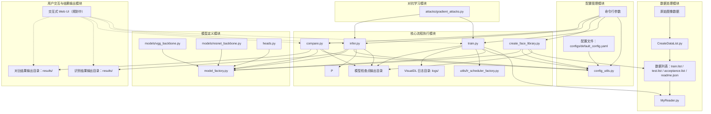

# 基于PaddlePaddle的人脸对比和人脸识别系统

> **重要提示**:
> * 训练和测试时的图像大小**必须保持一致**！模型加载时会优先使用模型文件中保存的图像大小。
> * **执行任何脚本前，请务必激活您的Python虚拟环境 (例如 `source paddle/bin/activate`)！**
> * **本项目的数据划分和评估流程已针对"识别训练集中的已知人物"这一封闭集任务进行优化。**

本项目利用 [PaddlePaddle](https://www.paddlepaddle.org.cn/) 深度学习框架，构建了一套灵活且高效的人脸对比和人脸识别系统。系统支持多种骨干网络和损失函数的组合，并通过集中的 YAML 配置文件和命令行参数实现了高度的可配置性。

**最新成果**: 我们已成功实现了 **多种骨干网络、损失函数、优化器、学习率调度器、学习率和权重衰减的共计 432 种组合的自动化训练和验收测试**。建立了一套**端到端的自动化评估管线**，从数据列表生成、模型训练到模型验收和结果汇总。特别是，通过 `run_acceptance_tests.sh` 脚本对所有模型在测试集上的最终性能进行批量验收，并将结果汇总到 CSV 文件。此外，利用 `visualize_results.py` 脚本能够自动读取 CSV 文件并生成多维度性能对比图表，实现**自动化结果可视化**，极大地提升了模型分析和选择的效率。

## ✨ 功能特性 (Core Features)

*   **灵活的模型组合**: 支持 VGG 和 ResNet 骨干网络，以及 CrossEntropy 和 ArcFace Loss。
*   **集中的配置管理**: 所有参数通过 `configs/default_config.yaml` 文件统一管理。
*   **命令行参数覆盖**: 支持通过命令行动态调整关键参数，方便实验。
*   **自动化训练脚本**: 提供 `train.sh` 脚本，支持对多种模型配置进行批量自动化训练和测试。该脚本会为 VisualDL 产生结构化的日志，为后续可视化打基础。
*   **全面的实验可视化与对比**: 利用 VisualDL 记录训练过程中的关键指标（损失、准确率、学习率、参数分布、图像样本、网络结构、超参数组合等），支持对不同超参数组合的实验结果进行层次化筛选和直观对比。
*   **高效的数据读取**: 基于 `MyReader.py` 实现自定义数据集加载和预处理。
*   **训练断点恢复**: 支持从检查点恢复训练，节省时间和计算资源。
*   **人脸特征提取、对比与识别**: 提供相应的脚本 (`create_face_library.py`, `compare.py`, `infer.py`) 实现核心人脸功能。
*   **数据增强**: 训练时支持随机翻转、亮度对比度调整等数据增强策略，提高模型泛化能力。
*   **云服务器自动训练**: 提供自动化训练脚本，支持在云服务器上持续训练和参数调整。
*   **[规划中] 对抗攻击与防御**: 实现FGSM、PGD等对抗攻击方法，并集成对抗训练以增强模型鲁棒性。
*   **自动化验收结果汇总与可视化**: `run_acceptance_tests.sh` 将所有模型的验收结果汇总到 CSV 文件。提供 `visualize_results.py` 脚本，用于读取此 CSV 文件并自动生成多维度性能对比图表，这些图表能直观展示：
    * **不同骨干网络 (model_type) 的平均准确率对比。**
    * **不同损失函数 (loss_type) 的平均准确率对比。**
    * **不同优化器 (optimizer) 的平均准确率对比。**
    * **不同学习率调度器 (lr_schedule) 的平均准确率对比。**
    * **学习率 (learning_rate) 与最终准确率的关系散点图** (颜色可区分不同参数组合)。
    * **权重衰减 (weight_decay) 与最终准确率的关系散点图** (颜色可区分不同参数组合)。
    * **所有配置组合按准确率排序的柱状图** (快速找到最佳配置)。
  这些图表将自动保存到指定目录，极大地方便了实验结果的分析和模型选择。

## 🚀 快速上手 (Quick Start)

<details>
<summary>点击展开/折叠快速上手步骤</summary>

1.  **克隆仓库**:
    ```bash
    git clone https://github.com/Nahjs/Face-Recognition.git
    cd Face-Recognition
    ```
2.  **创建并激活Python虚拟环境** (推荐):
    ```bash
    python3 -m venv paddle
    # Linux/macOS:
    source paddle/bin/activate
    # Windows:
    # paddle\Scripts\activate
    ```
    **重要**: 后续所有 `python` 或 `pip` 命令都应在此激活的虚拟环境中执行。

3.  **安装依赖**:
    (推荐使用GPU版本以获得更好性能)
    ```bash
    # 确保 paddle 虚拟环境已激活
    # GPU 版本 (示例为CUDA 12.6, 请根据您的CUDA版本和PaddlePaddle官网查找对应安装命令)
    python -m pip install paddlepaddle-gpu==3.0.0 -i https://www.paddlepaddle.org.cn/packages/stable/cu126/
    pip install -i https://pypi.tuna.tsinghua.edu.cn/simple/  numpy==1.26.4 PyYAML opencv-python==4.5.5.64 matplotlib==3.5.3 scikit-learn tqdm
    ```
    (如果无GPU或仅测试，可安装CPU版本)
    ```bash
    # CPU 版本
    # python -m pip install paddlepaddle==2.4.2 # CPU 版本可能也需要调整 numpy
    # pip uninstall numpy -y
    # pip install -i https://pypi.tuna.tsinghua.edu.cn/simple/ numpy==1.26.4 PyYAML opencv-python==4.5.5.64 matplotlib==3.5.3 scikit-learn tqdm visualdl
    ```
    详细的环境准备和依赖安装说明请参见 [⚠️ 重要环境准备](#️-重要环境准备) 部分。

4.  **准备数据与数据列表**:
    * 按照 [1. 准备数据](#1-准备数据) 的说明组织您的人脸图像数据。
    * 运行脚本生成数据列表：
        ```bash
        # 激活虚拟环境后执行
        # 为默认数据集 (data/face) 生成列表
        # (如果存在旧文件，先手动删除)
        # rm -f data/face/train.list data/face/test.list data/face/acceptance.list data/face/readme.json
        python CreateDataList.py --data_root data/face --train_ratio 0.7 --acceptance_ratio 0.1

        # 为自定义数据集 (例如 data/my_faces) 生成列表
        # python CreateDataList.py --data_root data/my_faces
        ```
    **重要**:
    * 在重新生成列表前，请**手动删除**目标目录下（如 `data/face` 或 `data/my_faces`）已存在的 `train.list`, `test.list`, `acceptance.list` 和 `readme.json` 文件。
    * `CreateDataList.py` 脚本的参数 `--data_root` 指定的是**包含所有人物子文件夹的数据集根目录**。

5.  **修改配置**:
    * 打开 `configs/default_config.yaml`。
    * 根据您的数据集修改 `num_classes` (类别数量，应与 `CreateDataList.py` 生成的 `readme.json` 中 `total_classes` 一致)。
    * 选择或自定义一个 `active_config` 块 (例如 `resnet_arcface_steplr_config`) 并按需调整其参数 (如 `learning_rate`, `epochs`, `batch_size` 等)。详情参阅 [⚙️ 配置管理](#️-配置管理)。
6.  **执行核心功能示例** (确保已激活虚拟环境):
    * **模型训练**:
        ```bash
        # 示例：训练配置文件中 active_config 指向的配置
        # 注意：`--class_name` 参数不再需要，数据路径由 `data_dir` 和 `dataset_params` 中的列表文件名共同决定
        python train.py --config_path configs/default_config.yaml --use_gpu --source manual
        # 示例：通过命令行指定活动配置块 (假设 resnet_arcface_steplr_config 已在YAML中定义)
        # python train.py --config_path configs/default_config.yaml --active_config resnet_arcface_steplr_config --use_gpu --source manual
        ```
    * **查看训练日志与实验对比 (VisualDL)**:
        训练开始后或结束后，运行以下命令启动VisualDL服务：
        ```bash
        visualdl --logdir ./logs
        ```
        然后在浏览器中打开显示的地址 (通常是 `http://localhost:8040`)。
        详细使用方法见 [📊 模型与实验 (Models and Experiments)](#-模型与实验-models-and-experiments) 下的 [VisualDL 日志查看与实验对比](#visualdl-日志查看与实验对比) 章节。
    * **创建人脸特征库** (如果使用ArcFace模型):
        ```bash
        # 确保 --active_config 与训练时一致，或 --model_path 指向您训练好的ArcFace模型
        # --data_list_file 通常是训练列表，用于提取已知身份的特征
        python create_face_library.py \\
            --config_path configs/default_config.yaml \\
            --active_config resnet_arcface_cosine_config \\
            --model_path logs/resnet__arcface__CosineAnnealingDecay/YYYYMMDD-HHMMSS/checkpoints/best_model_resnet_arcface_cosine_config.pdparams \\
            --data_list_file data/face/train.list \\
            --use_gpu
        ```
        注意：`--model_path` 需要根据实际训练产出的路径进行修改，特别是时间戳部分。
    * **人脸识别**:
        ```bash
        # 确保 --active_config 与训练时一致，或 --model_path 指向对应模型
        python infer.py \\
            --config_path configs/default_config.yaml \\
            --model_path logs/resnet__arcface__CosineAnnealingDecay/YYYYMMDD-HHMMSS/checkpoints/best_model_resnet_arcface_cosine_config.pdparams \\
            --image_path data/face/person1/some_test_image.jpg \\
            --use_gpu
        ```
    * **人脸对比**:
        ```bash
        # 确保 --active_config 与训练时一致，或 --model_path 指向对应模型
        python compare.py \\
            --config_path configs/default_config.yaml \\
            --active_config resnet_arcface_cosine_config \\
            --model_path logs/resnet__arcface__CosineAnnealingDecay/YYYYMMDD-HHMMSS/checkpoints/best_model_resnet_arcface_cosine_config.pdparams \\
            --img1 data/face/person1/img1.jpg \\
            --img2 data/face/person2/1.jpg \\
            --use_gpu
        ```
</details>

## 📄 目录

* [✨ 功能特性 (Core Features)](#-功能特性-core-features)
* [🚀 快速上手 (Quick Start)](#-快速上手-quick-start)
* [项目架构与技术栈](#项目架构与技术栈)
    * [模块依赖图 (概念)](#模块依赖图-概念)
    * [核心技术栈](#核心技术栈)
    * [实验管理与可视化概览](#实验管理与可视化概览)
* [项目结构说明](#项目结构说明)
* [⚠️ 重要环境准备](#️-重要环境准备)
    * [1. 进入项目根目录](#1-进入项目根目录)
    * [2. 激活Python虚拟环境](#2-激活python虚拟环境)
    * [3. GPU用户环境变量设置](#3-gpu用户环境变量设置-重要)
    * [4. 安装依赖](#4-安装依赖-1)
* [⚙️ 配置管理](#️-配置管理)
    * [YAML配置文件概览 (`configs/default_config.yaml`)](#yaml配置文件概览-configsdefault_configyaml)
        * [全局设置 (`global_settings`)](#全局设置-global_settings)
        * [活动配置选择 (`active_config`)](#活动配置选择-active_config)
        * [具体配置块示例 (如 `resnet_arcface_config`)](#具体配置块示例-如-resnet_arcface_config)
        * [学习率调度器配置 (`lr_scheduler_type`, `lr_scheduler_params`)](#学习率调度器配置-lr_scheduler_type-lr_scheduler_params)
    * [命令行参数与覆盖规则](#命令行参数与覆盖规则)
    * [配置加载工具 (`config_utils.py`)](#配置加载工具-config_utilspy)
* [📖 详细使用指南](#-详细使用指南)
    * [1. 准备数据](#1-准备数据)
    * [2. 创建数据列表 (`CreateDataList.py`)](#2-创建数据列表-createdatalistpy)
    * [3. 模型训练 (`train.py`)](#3-模型训练-trainpy)
    * [4. 创建人脸特征库 (针对ArcFace模型, `create_face_library.py`)](#4-创建人脸特征库-针对arcface模型-create_face_librarypy)
    * [5. 人脸识别测试 (`infer.py`)](#5-人脸识别测试-inferpy)
    * [6. 人脸对比测试 (`compare.py`)](#6-人脸对比测试-comparepy)
    * [7. 更换数据集流程](#7-更换数据集流程)
* [📊 模型与实验 (Models and Experiments)](#-模型与实验-models-and-experiments)
    * [自动化正交训练测试](#自动化正交训练测试)
    * [VisualDL 日志查看与实验对比](#visualdl-日志查看与实验对比)
* [🛠️ 模型调优指南](#️-模型调优指南)
    * [参数调整示例](#参数调整示例)
    * [可调参数概览](#可调参数概览)
* [🛡️ 验收与评估 (Acceptance and Evaluation)](#️-验收与评估-acceptance-and-evaluation)
* [📊 结果分析与解读 (Result Analysis and Interpretation)](#-结果分析与解读-result-analysis-and-interpretation)
    * [独立测试集](#独立测试集)
    * [验收界面](#验收界面)
* [💡 技术实现细节](#-技术实现细节)
    * [VisualDL 日志记录](#visualdl-日志记录)
* [🔮 下一步计划 (Future Plans)](#-下一步计划-future-plans)
    * [交互式Web应用与可视化](#1-交互式web应用与可视化)
    * [即时个性化识别](#2-即时个性化识别)
    * [对抗网络与鲁棒性增强](#3-对抗网络与鲁棒性增强)
    * [Optuna 超参数调优](#4-optuna-超参数调优)
    * [更多数据集集成与模型部署](#5-更多数据集集成与模型部署)
* [❓ 常见问题解决 (FAQ)](#-常见问题解决-faq)
* [📝 注意事项](#-注意事项)
* [🤝 贡献 (Contributing)](#-贡献-contributing)
* [📄 许可证 (License)](#-许可证-license)
* [🙏 致谢 (Acknowledgements)](#-致谢-acknowledgements)


## 项目架构与技术栈

### 模块依赖图（概念）


*(本图展示了本项目中各核心模块之间的依赖关系与数据流动，涵盖了数据预处理、模型训练、特征提取与识别推理等主要过程。)*

### 核心技术栈
*   **核心框架**: 本项目基于 PaddlePaddle 深度学习框架开发，并在 paddlepaddle-gpu==3.0.0 环境下测试通过。
*   **编程语言**: Python 3.8 及以上版本。
*   **主要依赖**:
    *   `PyYAML`: 用于解析YAML配置文件。
    *   `opencv-python`: 用于图像读取和预处理。
    *   `matplotlib`: 用于结果可视化。
    *   `scikit-learn`: (可能用于评估指标，或辅助数据处理)。
    *   `tqdm`: 用于显示进度条。
    *   `numpy`: 数值计算基础库。
    *   `visualdl`: PaddlePaddle官方可视化分析工具。

### 实验管理与可视化概览
本项目高度重视实验的可追溯性和结果的可视化分析。
*   **结构化日志**: `train.py` 在执行时，会为每个超参数组合（骨干网络、损失函数、学习率调度器等）生成结构化的日志。这些日志保存在 `logs/` 目录下，遵循 `logs/<backbone>__<loss>__<lr_scheduler>/<timestamp>` 的命名约定。例如，一次 ResNet50 + ArcFace + Cosine 调度器的训练日志可能位于 `logs/resnet__arcface__CosineAnnealingDecay/20231028-153000/`。
*   **VisualDL**: 我们使用 PaddlePaddle 的可视化工具 VisualDL 来解析这些日志。VisualDL 能够展示训练过程中的标量数据（如损失、准确率曲线）、图像数据（数据增强样本、模型输出）、参数分布直方图、网络结构以及超参数对比 (HParams)。
*   **层次化 Tag**: 在每个运行的日志内部，关键指标使用统一的 Tag 命名，如 `Loss/Train_Epoch`, `Metric/Eval_Accuracy_Epoch`。这使得在 VisualDL 中可以方便地跨不同实验运行对比相同的指标。

通过这种方式，我们可以有效地管理和比较多次实验的结果，从而指导模型优化。详细的 VisualDL 使用方法见 [VisualDL 日志查看与实验对比](#visualdl-日志查看与实验对比) 章节。

## 项目结构说明
```
Face-Recognition/
├── attacks/                  # [新增/规划中] 对抗攻击实现模块
│   └── gradient_attacks.py   # FGSM, PGD等基于梯度的攻击
├── configs/                  # 配置目录
│   └── default_config.yaml   # 默认YAML配置文件
├── data/                     # 数据目录 (示例: data/face)
│   └── face/                 # 示例人脸数据集 (可替换为 data/<config.class_name>)
│       ├── person1/
│       │   └── 1.jpg
│       │   └── ...
│       └── person2/
│           └── 1.jpg
│           └── ...
├── logs/                     # VisualDL 日志保存根目录
│   └── <backbone>__<loss>__<lr_scheduler>/ # 每个超参组合的父目录
│       └── <timestamp>/          # 具体某次运行的日志 (包含VDL文件、模型检查点等)
│           ├── checkpoints/      # 模型检查点
│           │   ├── best_model_....pdparams
│           │   └── checkpoint_....pdparams
│           ├── model.pdmodel     # [如果导出成功] 用于网络结构可视化的模型
│           ├── model.pdiparams   # [如果导出成功]
│           └── ...               # VisualDL 的其他日志文件
├── models/                   # 存放骨干网络定义
│   ├── vgg_backbone.py       # VGG骨干网络定义
│   ├── resnet_backbone.py    # ResNet骨干网络定义
├── heads.py                  # 存放模型头部定义
├── utils/                    # 存放工具/辅助模块
│   ├── lr_scheduler_factory.py # 学习率调度器工厂
│   ├── checkpoint_manager.py # 检查点管理
│   └── utils.py              # 通用工具函数 (如 get_git_commit_hash)
├── results/                  # 推理和对比结果图片保存目录
├── CreateDataList.py         # 创建数据列表脚本
├── MyReader.py               # 图像读取和预处理模块
├── config_utils.py           # 配置加载与合并工具模块
├── train.py                  # 模型训练脚本
├── create_face_library.py    # 创建人脸特征库脚本
├── infer.py                  # 人脸识别预测脚本
├── compare.py                # 人脸对比工具脚本
├── train.sh                  # 自动化训练脚本
├── acceptance_test.py        # 自动化验收脚本 (Python部分)：加载模型，在测试集上进行评估，根据模型类型执行分类评估或基于特征库的比对识别，输出 JSON 结果
├── run_acceptance_tests.sh  # 自动化批量验收脚本 (Shell部分)：遍历所有训练成功的模型，调用 create_face_library.py (对ArcFace) 和 acceptance_test.py，解析JSON结果，记录到 CSV
├── visualize_results.py     # 结果可视化脚本：读取验收结果 CSV，生成各种性能对比图表
├── acceptance_summary_results/ # `run_acceptance_tests.sh` 产生的验收结果汇总 CSV 和图表
│   ├── acceptance_results_YYYYMMDD-HHMMSS.csv # 汇总结果 CSV
│   └── plots/                   # `visualize_results.py` 生成的图表目录
│       └── [各种性能对比图表 .png]
├── log_tuning_run.py         # 手动记录调参日志脚本
└── README.md                 # 项目说明文档 (本文档)
```

## ⚠️ 重要环境准备
[(返回目录)](#-目录)

在开始之前，请确保您已完成以下环境设置：

### 1. 进入项目根目录
所有后续命令都应在克隆本仓库后的 `Face-Recognition` 目录下执行。
```bash
    cd path/to/Face-Recognition
```

### 2. 激活Python虚拟环境
本项目推荐使用名为 `paddle` 的虚拟环境。
```bash
# 如果是第一次，创建虚拟环境:
    # python3 -m venv paddle
    # Linux/macOS:
    source paddle/bin/activate
    # Windows:
    # paddle\Scripts\activate
```
**非常重要**: 每次执行项目中的 Python 脚本 (`train.py`, `infer.py` 等) 或 `pip install` 命令前，都请确保您已在当前终端会话中激活了此虚拟环境。

### 3. GPU用户环境变量设置 (重要)
如果您计划使用GPU进行训练或推理，请在您的终端会话中设置以下环境变量。将这些命令添加到您的 `~/.bashrc` 或 `~/.zshrc` 文件中可以使其永久生效。
```bash
# 根据您的CUDA实际安装路径调整
export CUDA_HOME=/usr/local/cuda
# 对于WSL用户，可能需要包含 /usr/lib/wsl/lib
export LD_LIBRARY_PATH=$LD_LIBRARY_PATH:$CUDA_HOME/lib64:/usr/lib/wsl/lib
```
运行 `source ~/.bashrc` (或对应的shell配置文件) 使更改生效。

### 4. 安装依赖
请参考 [🚀 快速上手 (Quick Start)](#-快速上手-quick-start)部分的依赖安装命令。确保在已激活的 `paddle` 虚拟环境中执行。

## ⚙️ 配置管理
[(返回目录)](#-目录)

本项目采用YAML文件 (`configs/default_config.yaml`) 结合命令行参数的方式进行配置管理，由 `config_utils.py` 模块实现加载和合并逻辑。

### YAML配置文件概览 (`configs/default_config.yaml`)
包含 `global_settings` (全局默认参数) 和多个特定配置块 (如 `resnet_arcface_config`)。通过 `active_config` 键指定当前要激活的配置块。

#### 全局设置 (`global_settings`)
适用于所有模式的基础配置，会被活动配置块中的同名参数覆盖。
```yaml
# configs/default_config.yaml (部分示例)
global_settings:
use_gpu: true
seed: 42
  image_size: 112      # 输入图像尺寸
  data_dir: 'data'     # 数据集根目录
  # class_name: 'face' # 不再需要全局 class_name, 由 MyReader.py 根据列表文件确定
  model_save_dir: 'model' # 旧的保存目录，实际检查点保存在 visualdl_log_dir 下
  num_classes: 100     # 重要: 必须根据实际数据集修改! (对应 readme.json 中的 total_classes)
  epochs: 10           # 默认训练轮数
  batch_size: 64
  learning_rate: 0.1
  optimizer_type: Momentum
  lr_scheduler_type: StepDecay
  log_interval: 10     # 控制台日志打印间隔 (batch steps)
  resume: false        # 是否从检查点恢复
  visualdl_log_dir: "logs" # VisualDL 日志保存的根目录

  dataset_params:
    train_list: "train.list" # 列表文件名，会与 data_dir/<class_name_from_readme> 拼接
    eval_list: "test.list"
    acceptance_list: "acceptance.list"
    num_workers: 4
    mean: [0.5, 0.5, 0.5]
    std: [0.5, 0.5, 0.5]

  log_train_image_interval: 5   # 训练时记录图像的 epoch 间隔
  log_eval_image_interval: 5    # 评估时记录图像的 epoch 间隔
  log_histogram_interval: 2   # 记录参数直方图的 epoch 间隔
# ... 其他全局设置 ...
```
**注意**: `class_name` 的概念已弱化。`MyReader.py` 现在通过 `config.data_dir` 和 `config.dataset_params.train_list` (或 `eval_list` 等) 结合来定位数据列表文件。`CreateDataList.py` 生成的 `readme.json` 中的类别名信息主要用于参考。`train.py` 等脚本不再需要 `--class_name` 命令行参数。

#### 活动配置选择 (`active_config`)
修改此值以选择不同的预设配置块。
```yaml
active_config: 'resnet_arcface_cosine_config' # 示例
```

#### 具体配置块示例 (如 `resnet_arcface_cosine_config`)
定义特定模型、损失、超参数组合。
```yaml
resnet_arcface_cosine_config:
  model_type: 'resnet'
  loss_type: 'arcface'
  optimizer_type: 'AdamW'
  lr_scheduler_type: 'CosineAnnealingDecay'
```

#### 学习率调度器配置 (`lr_scheduler_type`, `lr_scheduler_params`)
*   `lr_scheduler_type`: 指定调度器类型，如 `StepDecay`, `MultiStepDecay`, `CosineAnnealingDecay`等。
*   `lr_scheduler_params`: 包含一个与 `lr_scheduler_type` 同名（小写）的键，其值为该调度器的具体参数。还可包含一个可选的 `warmup` 子块。
```yaml
    lr_scheduler_type: 'MultiStepDecay'
    lr_scheduler_params:
      multistepdecay: # 键名与 lr_scheduler_type (小写) 对应
        milestones: [30, 60, 90]
        gamma: 0.1
      warmup:
        use_warmup: true
        warmup_steps: 500
        start_lr: 0.00001
```

### 命令行参数与覆盖规则
*   `--config_path`: 指定YAML文件。
*   `--active_config`: 覆盖YAML中的 `active_config`。
*   `--use_gpu`/`--no-use_gpu` (或 `--use_gpu False`), `--resume`/`--no-resume`: 开关参数。
*   其他参数如 `--learning_rate`, `--batch_size`, `--epochs`, `--visualdl_log_dir` 等可直接覆盖YAML中的值。
*   **优先级**: 命令行参数 > 活动配置块 > 全局设置。

### 配置加载工具 (`config_utils.py`)
`load_config` 函数负责加载和合并所有配置源，返回一个可通过属性访问的 `ConfigObject` 对象。

## 📖 详细使用指南
**提醒：执行所有Python脚本前，请确保已激活 `paddle` 虚拟环境。**
[(返回目录)](#-目录)

### **1. 准备数据**
将人脸数据按以下结构存放 (假设 `config.data_dir` 为 `data`, 并且您的人脸类别子目录直接在 `data/face` 下):
```
data/face/  # <--- 这个 'face' 目录将作为 CreateDataList.py 的输入
├── person1/
│   ├── 1.jpg ...
├── person2/
│   ├── 1.jpg ...
└── ...
```
`train.py` 会根据 `config.data_dir` (例如 `data`) 和 `config.dataset_params.train_list` (例如 `face/train.list`) 来定位实际的列表文件。确保 `CreateDataList.py` 生成的列表文件中的相对路径是正确的。

建议预先对人脸进行检测和裁剪，确保人脸区域清晰且大小适中。

### **2. 创建数据列表 (`CreateDataList.py`)**
此脚本遍历指定的数据集根目录，生成训练/测试/验收集列表和元数据文件。
```bash
# 示例: 为 data/face/ 目录下的类别子文件夹生成列表文件
# 生成的列表会直接存放在 data/face/ 目录下
# (如果存在旧文件，先手动删除: rm -f data/face/*.list data/face/readme.json)
python CreateDataList.py --data_root data/face --train_ratio 0.7 --acceptance_ratio 0.1

# 假设您的数据集类别在 data/my_dataset/ 下
# python CreateDataList.py --data_root data/my_dataset
```
*   **重要**: `readme.json` 中的 `total_classes` 值必须与您在 `configs/default_config.yaml` 中为训练设置的 `num_classes` **保持一致**。
*   生成的列表文件（如 `train.list`, `test.list`, `acceptance.list`）和元数据文件 (`readme.json`) 会保存在 `--data_root` 指定的目录中。

### **3. 模型训练 (`train.py`)**
负责执行模型的训练流程。
```bash
# 激活 paddle 环境后执行

# 示例1: 使用YAML中默认的 active_config 进行训练
python train.py --config_path configs/default_config.yaml --use_gpu --source manual

# 示例2: 通过命令行指定一个在YAML中定义好的活动配置块
python train.py --config_path configs/default_config.yaml --active_config resnet_arcface_cosine_config --use_gpu --resume --source manual
```
*   `--source manual`: 标记为手动运行的训练。
*   模型训练产生的日志（用于VisualDL）、模型检查点 (`checkpoint_....pdparams`) 和最佳模型 (`best_model_....pdparams`) 会保存在 `config.visualdl_log_dir` 指定的目录下，并根据超参组合和时间戳创建子目录。例如：`logs/<backbone>__<loss>__<lr_scheduler>/<timestamp>/checkpoints/`。
*   训练完成后，请参考 [VisualDL 日志查看与实验对比](#visualdl-日志查看与实验对比) 章节查看训练过程。

### **4. 创建人脸特征库 (针对ArcFace模型, `create_face_library.py`)**
如果模型使用 ArcFace Loss 训练，则需要创建特征库用于后续1:N识别。
```bash
# 激活 paddle 环境后执行
# --model_path 应指向训练好的ArcFace模型的 .pdparams 文件
# --data_list_file 通常是训练列表，用于提取已知身份的特征
# --active_config 用来加载模型结构和图像尺寸等参数
python create_face_library.py \\
    --config_path configs/default_config.yaml \\
    --active_config resnet_arcface_cosine_config \\
    --model_path logs/resnet__arcface__CosineAnnealingDecay/YYYYMMDD-HHMMSS/checkpoints/best_model_resnet_arcface_cosine_config.pdparams \\
    --data_list_file data/face/train.list \\
    --use_gpu
```
*   注意替换 `--model_path` 中的 `YYYYMMDD-HHMMSS` 为实际的时间戳。
*   生成的 `.pkl` 特征库文件路径由配置文件中 `active_config` 下的 `create_library.output_library_path` 指定。确保该路径指向一个合理的位置，例如 `model/` 目录下并包含配置信息的文件名。

### **5. 人脸识别测试 (`infer.py`)**
对单张人脸图像进行身份识别。
```bash
# 激活 paddle 环境后执行
python infer.py \\
    --config_path configs/default_config.yaml \\
    --active_config resnet_arcface_cosine_config \\
    --model_path logs/resnet__arcface__CosineAnnealingDecay/YYYYMMDD-HHMMSS/checkpoints/best_model_resnet_arcface_cosine_config.pdparams \\
    --image_path data/face/person1/some_test_image.jpg \\
    --use_gpu
```
*   ArcFace模型会将输入图像特征与特征库 (`infer.face_library_path` 指定) 比对。
*   CrossEntropy模型直接输出分类概率最高的身份。

### **6. 人脸对比测试 (`compare.py`)**
对比两张人脸图像的相似度。
```bash
# 激活 paddle 环境后执行
python compare.py \\
    --config_path configs/default_config.yaml \\
    --active_config resnet_arcface_cosine_config \\
    --model_path logs/resnet__arcface__CosineAnnealingDecay/YYYYMMDD-HHMMSS/checkpoints/best_model_resnet_arcface_cosine_config.pdparams \\
    --img1 data/face/person1/img1.jpg \\
    --img2 data/face/person2/1.jpg \\
    --use_gpu
```

### **7. 更换数据集流程**
1.  **准备新数据集**: 按 [1. 准备数据](#1-准备数据) 的规范组织图像，例如存放在 `data/my_new_dataset`。
2.  **创建数据列表**: 运行 `python CreateDataList.py --data_root data/my_new_dataset`。记下生成的 `readme.json` 中的 `total_classes`。
3.  **配置YAML文件**:
    *   建议复制 `configs/default_config.yaml` 为例如 `configs/my_new_dataset_config.yaml` (或在默认文件中新增配置块)。
    *   修改配置：
        *   更新 `active_config` 指向新配置块。
        *   在全局或活动配置块中，更新 `data_dir: 'data'` (如果列表仍在 `data` 下的子目录)。
        *   更新 `dataset_params` 中的 `train_list`, `eval_list`, `acceptance_list` 指向新数据集的列表文件相对路径，例如 `my_new_dataset/train.list`。
        *   **非常重要**: 更新 `num_classes` 为新数据集的实际类别总数。
        *   (可选) 为新模型指定新的 `visualdl_log_dir` 或确保组合名能区分。
        *   更新 `infer`, `compare`, `create_library` 配置块中相关的 `label_file` (应为 `my_new_dataset/readme.json`) 和特征库路径。
4.  **开始新数据集训练**:
    ```bash
    # 激活 paddle 环境后执行
    python train.py --config_path configs/my_new_dataset_config.yaml --active_config <your_new_config_block> --use_gpu --source manual
    ```

## 📊 模型与实验 (Models and Experiments)
[(返回目录)](#-目录)

### 自动化正交训练测试
本项目通过 `train.sh` 脚本实现了对多种骨干网络、损失函数和学习率调度器组合的自动化批量训练。
*   **脚本**: `train.sh` (请根据您的环境调整其中的 `PROJECT_DIR`, `VENV_PATH` 等)。
*   **配置**: `train.sh` 中的 `CONFIG_NAMES_TO_TRAIN` 数组定义了要训练的配置块名称，这些名称必须在 `configs/default_config.yaml` 中有对应的配置块定义。
*   **日志生成**: `train.sh` 脚本执行每个组合时，会调用 `train.py`。`train.py` 会自动在 `config.visualdl_log_dir` (默认为 `logs/`) 下，根据 `<backbone>__<loss>__<lr_scheduler>/<timestamp>` 结构创建独立的日志目录。
*   **统一查看**: 所有这些独立运行的日志都可以通过 VisualDL 一起加载和对比，只需将 VisualDL 指向 `logs/` 根目录。
*   **输出**: 每个训练组合会生成对应的检查点和最佳模型文件，保存在其各自的日志子目录下的 `checkpoints/` 中。

### VisualDL 日志查看与实验对比
VisualDL 是 PaddlePaddle 提供的强大的可视化分析工具，本项目充分利用其记录和展示实验过程。

**1. 日志生成说明**
*   `train.py` 在运行时，会自动根据配置文件中的 `visualdl_log_dir` (默认为 `logs/`) 和当前的超参数组合（骨干、损失、学习率调度器）及时间戳，创建独立的日志目录。
    *   例如，一次VGG + CrossEntropy + StepDecay的训练日志可能保存在：`logs/vgg__cross_entropy__StepDecay/20231028-120000/`。
*   这个目录中包含了 VisualDL 所需的所有数据文件，记录了标量（损失、准确率）、图像、直方图、网络结构（如果导出成功）和超参数信息。

**2. 启动 VisualDL 服务**
在项目根目录下，激活虚拟环境后，运行以下命令：
```bash
visualdl --logdir ./logs
```
*   `--logdir ./logs` 参数告诉 VisualDL扫描 `logs` 目录及其所有子目录以查找实验数据。
*   启动成功后，终端会显示访问地址，通常是 `http://localhost:8040` 或类似地址。在浏览器中打开此地址即可进入 VisualDL Web UI。

**3. 界面导航概览**
VisualDL界面通常包含以下主要面板：
*   **标量数据 (Scalar)**: 显示训练过程中标量指标（如损失函数值、准确率、学习率）随训练步数或epoch的变化曲线。**这是进行实验对比的核心面板。**
*   **图像 (Image)**: 展示训练过程中记录的图像数据，如数据增强后的样本、模型预测的可视化结果等。
*   **直方图 (Histogram)**: 显示模型权重、梯度等参数的分布情况，有助于分析模型的训练状态和潜在问题。
*   **网络结构 (Graph)**: [如果模型导出成功] 可视化模型的计算图结构。
*   **超参数 (HParams)**: 以表格和并行坐标图的形式展示不同超参数组合与最终性能指标的关联，便于快速筛选和比较不同配置。

**4. 核心：如何进行实验对比 (Scalar 面板)**
目标是能够在同一个图表中叠加显示来自不同实验运行（即不同超参数组合或不同时间戳的同一组合）的同一个指标曲线。

*   **步骤 1: 选择数据流 (Runs)**
    *   进入VisualDL后，通常在界面的某个位置（可能是左上角或有专门的"运行记录"/"Runs"选项卡/下拉菜单）会列出所有VisualDL从 `--logdir` 中扫描到的独立实验运行。
    *   这些运行的名称通常对应于您的日志子目录名，例如 `vgg__cross_entropy__StepDecay/20231028-120000`， `resnet__arcface__CosineAnnealingDecay/20231028-130000` 等。
    *   **勾选您想要对比的多个实验运行。** 这是实现跨实验对比的第一步。

*   **步骤 2: 进入"标量数据 (Scalar)"面板并关注左侧 Tag 导航区**
    *   在Scalar面板的左侧，会有一个Tag导航区域。这个区域会以树状结构或列表形式展示所有已选Runs中记录过的标量数据的Tag。
    *   由于我们在`train.py`中对每个run内部的标量Tag进行了简化（例如 `Loss/Train_Epoch`, `Metric/Eval_Accuracy_Epoch`），这些核心指标名称应该会清晰地显示在这里。

*   **步骤 3: 利用Tag树状结构或搜索框查找并勾选目标指标的Tag**
    *   展开Tag树状结构，找到您感兴趣的指标，例如 `Loss/Train_Epoch`。
    *   或者，在Tag导航区上方的搜索框中输入指标的Tag名称或部分名称（如 `Eval_Accuracy`）进行快速筛选。

*   **步骤 4: 勾选来自不同Runs的同一个指标Tag，实现曲线叠加对比**
    *   **关键操作**：当您在左侧Tag导航区找到目标指标（如 `Loss/Train_Epoch`）后，如果这个指标在您第一步选中的多个Runs中都存在，您会看到它在每个Run的条目下都出现。
    *   **分别勾选这些不同Runs下的同一个指标Tag。**
    *   例如，勾选：
        *   `vgg__cross_entropy__StepDecay/20231028-120000` 下的 `Loss/Train_Epoch`
        *   `resnet__arcface__CosineAnnealingDecay/20231028-130000` 下的 `Loss/Train_Epoch`
    *   当您这样做之后，VisualDL的右侧主图表区域会自动将这两条（或多条）`Loss/Train_Epoch`曲线绘制在同一个图表中，并用不同颜色加以区分。这就实现了跨实验的同指标对比。

*   **右侧图表区域与筛选**:
    *   右侧是主要的图表显示区域。
    *   图表上方的筛选框（如果有）通常用于对当前图表中 *已经显示* 的曲线进行进一步的过滤，它与左侧选择要 *加载哪些* 曲线到图表中的功能是不同的。

**5. HParams 插件的使用**
*   **启用**: 标准的VisualDL安装通常会自动识别并启用HParams功能，无需额外配置 `--plugins hparams`（旧版VisualDL可能需要）。
*   **数据来源**: HParams面板的数据来源于 `train.py` 中通过 `log_writer.add_hparams(hparams_dict, metrics_list)` 记录的超参数组合 (`hparams_dict`) 和对应的最终性能指标 (`metrics_list` 中的值，如 `Loss/Eval_Epoch` 的最终值)。
*   **功能**:
    *   **表格视图**: 清晰列出每次运行的超参数值和对应的性能指标结果。
    *   **平行坐标图**: 直观展示不同超参数维度对性能指标的影响趋势。
    *   **筛选与跳转**: 您可以根据超参数或性能指标的范围筛选感兴趣的运行，并从HParams面板快速跳转到对应运行的标量曲线面板查看详细训练过程。

#### VisualDL 图像数据 (Image) 查看详解

VisualDL 的"图像 (Image)"面板允许您可视化在训练和评估过程中记录的图片样本。这对于检查数据预处理、数据增强（主要在训练阶段）的效果，以及观察模型在不同阶段实际接收到的输入非常有用。

**如何使用:**

1.  **导航至图像面板**: 在 VisualDL 界面顶部导航栏中选择"图像 (Image)"选项卡。

2.  **选择运行实例**: 与标量数据类似，确保您已在左侧的运行列表 (Runs) 中勾选了想要查看的实验运行实例。一个运行实例通常对应于一次 `train.py` 的执行，其名称基于超参数组合和时间戳 (例如 `ResNet__ArcFace__StepDecay/20231027-153000`)。

3.  **理解图像标签层级**: 图片数据现在按以下层级结构组织，方便您筛选和查看：
    *   **主要类别 (Train/Eval/Acceptance)**: 图片首先会按照记录的阶段分为三大类：
        *   `Train`: 包含了训练过程中，在每个指定图片记录间隔的轮次 (epoch) 开始时，从当前批次 (batch) 中抽取的若干（通常是4张）经过数据增强的样本图片。
        *   `Eval`: 包含了评估过程中，在每个指定图片记录间隔的轮次 (epoch) 开始时，从当前评估批次 (batch) 中抽取的若干原始（通常也为4张，仅进行了必要的resize和归一化，无增强）样本图片。
        *   `Acceptance` (待实现): 如果在验收测试阶段也配置了图片记录，相关图片会显示在此类别下（当前版本的 `train.py` 未直接集成此阶段的图片日志，但如果 `acceptance_test.py` 或类似脚本被修改为向相同的 VisualDL 实验记录日志，则会在此出现）。
    *   **任务/数据集类别 (Task/Dataset Class)**: 在每个主要类别 (如 `Train`) 下，图片会根据其所属的任务或数据集类别进一步分组。这个类别名通常来自配置文件中的 `class_name` 字段 (例如，如果 `config.class_name` 为 `face`，则您会看到如 `Train/face/...` 的路径)。这使得当您处理多个数据集或任务时，可以方便地分别查看它们的图像数据。
    *   **具体图片样本**: 在任务类别下，您会看到具体的图片标签，例如 `Epoch1_Sample0`, `Epoch1_Sample1` 等，分别代表在第1个轮次记录的第0个和第1个样本图片。

4.  **使用滑块查看不同轮次 (Epoch) 的图片**: 面板顶部通常会有一个滑块。通过拖动此滑块，您可以选择不同的 **轮次 (Epoch)**（即图片记录时的 `step` 值），从而查看在不同训练阶段记录的图片。这对于观察模型输入随时间（训练进程）的变化特别有用。

5.  **图片显示**: 点击具体的图片标签后，对应的图片样本会显示在主区域。您可以同时选择和比较来自不同运行实例、不同阶段或不同轮次的图片。

通过这种方式，您可以直观地监控数据流水线，确保模型看到的是预期的数据，并对数据增强策略的有效性进行评估。

#### VisualDL 直方图 (Histogram) 查看
这两个面板同样会根据您选择的Runs来展示数据。
*   **Histogram**: 可以查看特定实验运行中，关键层权重和梯度的分布随训练的变化，有助于诊断训练问题。Tag通常是 `Hist/<layer_name>/Parameters` 或 `Hist/<layer_name>/Gradients`。

通过上述方法，您可以充分利用VisualDL对不同模型配置和训练运行进行深入的比较和分析。

## 🛠️ 模型调优指南
[(返回目录)](#-目录)
通过修改 `configs/default_config.yaml` 中的参数或通过命令行覆盖进行实验。

### 参数调整示例
修改 `learning_rate` 并指定一个特定的配置块进行训练：
```bash
# 激活 paddle 环境后执行
python train.py --config_path configs/default_config.yaml --active_config resnet_arcface_cosine_config --learning_rate 0.0005 --use_gpu
```

### 可调参数概览
*   **通用训练参数**: `learning_rate`, `batch_size`, `epochs`, `optimizer_type` (AdamW, Momentum), `optimizer_params.weight_decay`, `lr_scheduler_type` 及 `lr_scheduler_params` (各种调度器的特定参数，如 `T_max`, `eta_min`, `patience`, `factor`等)。
*   **模型结构参数**:
    *   `model_type`: 'vgg' 或 'resnet'。
    *   `model.resnet_params`: `feature_dim` (输出特征维度), `nf` (初始通道数), `n_resnet_blocks` (深度)。
    *   `model.vgg_params`: `dropout_rate`, `feature_dim`。
*   **损失函数参数** (主要针对ArcFace):
    *   `loss.arcface_params`: `arcface_s` (scale), `arcface_m2` (margin)。
*   **数据相关**: `image_size`，数据增强策略 (目前在 `MyReader.py` 中定义，未来可配置化)。

进行调优时，建议采用控制变量法，并详细记录实验结果（可使用 `log_tuning_run.py` 或 VisualDL 的 HParams 功能）。

## 🛡️ 验收与评估 (Acceptance and Evaluation)
[(返回目录)](#-目录)

### 独立测试集
采用与训练集和验证集（即`train.py`中`eval_loader`使用的数据，通常对应 `test.list`）完全独立的验收数据集进行最终的模型性能评估，以获得无偏结果。

*   **创建**: 从总数据中预留一部分作为最终验收测试集，例如 `data/face_acceptance_data/`。使用 `CreateDataList.py --data_root data/face_acceptance_data --train_ratio 0 --acceptance_ratio 0` (或调整比例以仅生成一个列表，例如都给test) 生成其独立的列表文件，例如 `data/face_acceptance_data/acceptance.list` 和 `readme.json`。
*   **评估脚本**: `acceptance_test.py` 脚本用于此目的。它会：
    1.  加载最终选定的最佳模型 (通过配置文件和命令行参数指定)。
    2.  读取验收测试集的列表文件 (由 `config.dataset_params.acceptance_list` 指定)。
    3.  遍历列表中的图片，执行人脸识别（1:N对比特征库）或分类。
    4.  计算标准评估指标，如Top-1/Top-5准确率（分类任务），或人脸验证的TAR@FAR。
    5.  输出最终性能报告。
*   **执行示例**:
```bash
    # 激活 paddle 环境后执行
    # 确保 active_config 指向的模型配置与 model_path 匹配
    # 确保配置文件中 dataset_params.acceptance_list 指向正确的验收列表
    python acceptance_test.py \\
        --config_path configs/default_config.yaml \\
        --active_config resnet_arcface_cosine_config \\
        --model_path logs/resnet__arcface__CosineAnnealingDecay/YYYYMMDD-HHMMSS/checkpoints/best_model_resnet_arcface_cosine_config.pdparams \\
        --use_gpu
```

### 验收界面
为了方便直观地展示模型效果和进行用户验收，可以开发一个简单的用户界面。

*   **功能**:
    *   上传单张图片进行人脸识别（显示预测身份和置信度/相似度）。
    *   上传两张图片进行人脸对比（显示相似度和是否同一人判断）。
*   **技术选型推荐**:
    *   **Streamlit / Gradio**: Python库，可以非常快速地为机器学习模型创建交互式Web应用界面，代码量少，非常适合快速原型和演示。**强烈推荐优先考虑！**
    *   **Flask/FastAPI + 前端 (HTML/JS/CSS)**: 更灵活，但开发周期更长。后端提供API接口，前端负责展示。

(更多关于交互式界面的想法见 [🔮 下一步计划 (Future Plans)](#-下一步计划-future-plans))


## 📊 结果分析与解读 (Result Analysis and Interpretation)
[(返回目录)](#-目录)

在 `run_acceptance_tests.sh` 运行完毕并使用 `visualize_results.py` 生成图表后，您可以进入 `acceptance_summary_results/plots/` 目录查看生成的 PNG 图表文件。这些图表能帮助您：

* **快速了解各类参数的影响**: 查看按骨干网络、损失函数、优化器、学习率调度器分组的柱状图，可以快速识别出在您的任务上，哪种模型类型、哪种训练策略通常能获得更好的平均性能。
* **深入分析连续参数效果**: 查看学习率 vs. 准确率和权重衰减 vs. 准确率的散点图。如果数据点呈现出趋势，您可以判断特定范围的 LR 或 WD 是否更有利于提高准确率。散点图上的颜色和标记可以帮助区分不同损失函数或骨干网络在不同 LR/WD 下的表现。
* **找到性能最佳的配置**: 查看按准确率排序的所有配置组合柱状图，可以直接定位到在测试集上表现最好的模型是哪几个配置组合。
* **识别潜在的参数交互**: 通过组合分析不同的图表，例如查看特定优化器在不同学习率调度器下的表现，或者某种骨干网络在使用不同损失函数时的差异，来发现参数之间的潜在交互效应。

结合原始的 `acceptance_summary_results_YYYYMMDD-HHMMSS.csv` 文件，您可以获取每个配置组合的详细参数和准确率，进行更精细的筛选和比较。这些分析结果将是您选择最终部署模型的重要依据。

## 💡 技术实现细节
[(返回目录)](#-目录)

*   **骨干网络**: `models/vgg_backbone.py`, `models/resnet_backbone.py` 定义了VGG和ResNet的变体。
*   **模型头部与损失函数**: `heads.py` 中封装了如 `ArcFaceHead` (利用 `paddle.nn.functional.margin_cross_entropy`) 和 `CrossEntropyHead` (标准线性分类头+交叉熵损失)。
*   **模型组装工厂**: `model_factory.py` 中的 `get_backbone` 和 `get_head` 根据配置动态创建骨干网络和头部模块实例。
*   **配置系统**: `config_utils.py` 中的 `load_config` 负责加载和合并来自YAML文件和命令行参数的配置，生成易于访问的 `ConfigObject`。
*   **数据处理与加载**: `CreateDataList.py` 生成训练/测试/验收集列表和元数据文件 (`readme.json`)。`MyReader.py` 实现 `paddle.io.Dataset` 和 `DataLoader`，负责图像读取、预处理（包括缩放、标准化）和数据增强。
*   **学习率调度**: `utils/lr_scheduler_factory.py` 根据配置创建学习率调度器实例，支持多种策略和Warmup。
*   **检查点管理**: `utils/checkpoint_manager.py` 负责在训练过程中保存和加载模型权重、优化器状态、学习率调度器状态以及训练元数据。检查点保存在每个运行实例的日志目录下的 `checkpoints/` 子目录中。
*   **VisualDL 日志记录**:
    *   `train.py` 中，通过 `visualdl.LogWriter(logdir=current_logdir)` 初始化日志记录器，其中 `current_logdir` 指向 `logs/<combo_name>/<timestamp>/`。
    *   标量数据通过 `log_writer.add_scalar(tag="Category/MetricName", value=..., step=...)` 记录。
    *   图像数据通过 `log_writer.add_image(...)` 记录。
    *   直方图数据通过 `log_writer.add_histogram(...)` 记录。
    *   超参数组合和最终指标通过 `log_writer.add_hparams(hparams_dict, metrics_list, step=0)` 记录，用于 HParams 面板。
    *   导出的网络结构模型路径（如果成功）通过 `log_writer.add_text(tag='GraphInfo/ExportedModelPath', ...)` 记录。
*   **[规划中] 对抗攻击**: `attacks/gradient_attacks.py` 将实现FGSM, PGD等攻击。
*   **[规划中] 对抗训练**: `train.py` 将集成对抗样本生成逻辑。

## 🔮 下一步计划 (Future Plans)
[(返回目录)](#-目录)

### 1. 交互式Web应用与可视化
*   **目标**: 开发一个交互式Web应用界面，用于：
*   **高级训练过程可视化**:
    *   展示训练过程中的损失、准确率、学习率等多种曲线。
    *   支持曲线动态切换与分组: 用户可以自定义组合筛选条件（如骨干网络、损失函数、学习策略、硬件平台GPU/CPU、训练来源自动/手动等）来对比不同模型或训练运行的表现。
*   **模型交互式验收**:
    *   用户通过界面上传图片进行实时的人脸识别（显示身份及置信度/相似度）和人脸对比。
*   **（进阶）Web端训练与参数调整**:
    *   允许用户在Web界面上选择模型配置、调整关键超参数，并远程启动/监控训练任务。
    *   这需要一个更强大的后端来管理任务队列、资源调度和实时日志反馈。可以先从生成配置文件或命令行开始，逐步过渡到完全的Web控制。
*   **技术选型思考**:
    *   快速原型/内部工具: Streamlit 或 Gradio (Python)。
    *   更定制化/生产级应用: Flask/FastAPI (Python后端) + React/Vue/Plotly.js (前端)。

### 2. 即时个性化识别
*   **目标**: 实现用户可以使用自己的照片快速训练（或更新模型），使系统能够立即识别出该用户。
*   **实现路径**:
    *   **数据便捷上传**: 提供简单的用户照片上传和管理界面。
    *   **特征库动态更新 (针对ArcFace类模型)**:
        *   提取新用户照片的特征向量。
        *   将新特征（或其平均值）添加到现有的人脸特征库 (`.pkl`文件) 中。
        *   这种方式无需重新训练整个模型，响应速度快。
    *   **模型微调 (Fine-tuning)**:
        *   对于CrossEntropy模型，或当需要更高精度/新用户数据较多时。
        *   在原有预训练模型的基础上，使用包含新用户的数据集进行少量轮次的微调。`train.py` 的断点续训和学习率调整功能可支持此操作。

### 3. 对抗网络与鲁棒性增强
*   **目标**: 研究和实现常见的对抗攻击方法，评估模型在这些攻击下的脆弱性，并应用对抗训练等防御策略来提升模型的鲁棒性。
*   **行动计划**:
    *   **环境准备**: 确保 PaddlePaddle 环境就绪。
    *   **创建攻击模块 (`attacks/`)**:
        *   在项目根目录下创建 `attacks/` 文件夹。
        *   创建 `attacks/gradient_attacks.py` 文件。实现 `fgsm_attack` 和 `pgd_attack` 函数。
        *   **核心**: 攻击函数需要接收模型（或一个能从输入图像计算到最终损失的函数）、原始图像、真实标签和攻击参数（如 `epsilon`）。它们会计算损失对于输入图像的梯度，并据此生成对抗扰动。
        *   **模型调用**: 需适配您项目中从图像到损失的计算方式。例如，可以传递一个 lambda 函数：`loss_fn_for_attack = lambda model, imgs, lbls: model.head(model.backbone(imgs), lbls)[0]` （假设head返回 `loss, acc_output`）。
        *   **像素值范围**: 确保对抗样本生成过程中的 `clip` 操作（限制像素值范围）与您数据预处理后的图像范围一致（例如，如果预处理后是标准化数据，则clip范围可能不是[0,1]，或者在攻击前/后进行适当的(逆)标准化）。
    *   **（可选）实现2D GAN生成对抗扰动**:
        *   在 `models/` 目录下创建 `generator_2d.py` 和 `discriminator_2d.py`。
        *   生成器应为编码器-解码器结构，输入原始图像，输出微小扰动。判别器则区分原始图像和添加了生成扰动的图像。
    *   **修改训练脚本 (`train.py`) 以集成对抗训练**:
        *   在 `configs/default_config.yaml` 的全局设置或活动配置块中添加对抗训练相关的配置项（已在上方示例中给出）。
        *   `train.py` 中加载这些配置。
        *   在训练循环的每个batch中，如果启用了对抗训练 (`config.adversarial_training is True`):
            *   获取当前batch的原始图像 `x` 和标签 `y`。
            *   调用实现的攻击函数（如 `pgd_attack(model_fn_for_attack, x, y, config.epsilon, config.alpha, config.num_iter)`）生成对抗样本 `x_adv`。
            *   使用对抗样本 (`x_adv, y`) 来计算损失（通过 `head_module_instance(backbone_instance(x_adv), y)`）并进行反向传播和参数更新。
            *   （可选）可以采用混合训练策略，例如，一半的step用原始样本，一半用对抗样本，或者将对抗损失作为正则项加入总损失。
    *   **训练过程中监控鲁棒性**:
        *   在每个epoch结束后的评估阶段，除了在原始测试集上评估模型准确率，还应在对抗测试集上评估模型的准确率。对抗测试集可以通过对原始测试集样本应用PGD等攻击方法动态生成。这将直观地展示对抗训练是否有效提升了模型的鲁棒性。
    *   **修改评估/推理脚本 (`infer.py` 或创建新的 `evaluate_robustness.py`)**:
        *   添加功能：加载已训练模型，读取单张或多张测试图片。
        *   调用攻击函数生成这些图片的对抗样本。
        *   用模型分别对原始图片和对抗样本进行推理，对比预测结果。
        *   计算指标：如攻击成功率（模型对原始样本预测正确，但对相应对抗样本预测错误的比率）、在对抗样本上的准确率。
        *   可视化：添加功能以并列展示原始人脸图像、计算出的扰动（可能需要放大以便观察）、以及最终的对抗样本图像。
    *   **更新文档 (`README.md`)**:
        *   在本文档中（例如，在"功能特性"或创建一个新的专门章节"对抗鲁棒性研究"）详细说明已实现的对抗攻击方法、对抗训练策略。
        *   解释如何配置和运行相关脚本（如何生成对抗样本，如何进行对抗训练，如何评估鲁棒性）。
        *   总结实验结果和观察到的现象。

### 4. Optuna 超参数调优
*   按原计划，利用 Optuna 框架对表现较好的模型组合（例如，通过自动化正交测试筛选出的顶尖配置）进行更细致和系统的超参数搜索与优化，目标是进一步提升模型性能。
*   **调优参数范围**: 学习率、批大小、权重衰减、ResNet的 `nf` 和 `n_resnet_blocks`、ArcFace的 `s` 和 `m2` 等。
*   **实施**: 开发Optuna集成脚本，该脚本会调用 `train.py` 并传入不同的超参数组合，然后基于验证集性能（如最高准确率或最低损失）来指导Optuna的搜索。

### 5. 更多数据集集成与模型部署
*   **数据集**: 考虑在更广泛、更具挑战性的人脸数据集（如CASIA-WebFace的子集、MS-Celeb-1M的子集，注意数据使用规范）上训练和评估模型，以提升泛化能力。
*   **模型部署**: 研究将训练好的PaddlePaddle模型转换为Paddle Inference格式（用于服务器端高效推理）或ONNX格式（用于跨平台部署，如移动端或边缘设备）。探索使用Paddle Serving或Paddle Lite进行服务化部署或端侧部署。

## ❓ 常见问题解决 (FAQ)
[(返回目录)](#-目录)

*   **环境与安装问题**:
    *   `paddlepaddle` 安装失败或版本冲突: 查阅官网，确保Python/CUDA版本匹配。
    *   `numpy` ABI 错误: 尝试 `pip uninstall numpy -y && pip install numpy==1.26.4`。
    *   `ImportError: libcudart.so.X.X`: 检查 `CUDA_HOME` 和 `LD_LIBRARY_PATH`。
*   **数据准备问题**:
    *   `CreateDataList.py` 未生成列表或 `readme.json` 不符合预期: 检查数据集目录结构和图片。确保 `--data_root` 指向包含类别子文件夹的目录。
    *   训练时找不到图片或列表: 检查 `config.data_dir` 和 `config.dataset_params.*_list` 的配置，确保它们能正确拼接成列表文件的完整路径 (例如 `data/face/train.list`)。
*   **训练过程问题**:
    *   不收敛，Loss不降/上升: 学习率过高？数据问题？ArcFace参数不当？
    *   GPU显存不足 (OOM): 减小 `batch_size` 或 `image_size`，或使用更轻量模型。
    *   过拟合: 增加数据/增强，加大正则化 (`weight_decay`)，Early Stopping (手动观察)。
*   **ArcFace 相关问题**:
    *   特征库生成不准确: 确保模型已正确训练。
    *   推理时都识别为"未知": 特征库问题？阈值过高？
*   **图像大小不一致错误**: 确保训练、建库、推理、对比各阶段 `image_size` 一致。模型文件会保存训练时的 `image_size` 并优先使用。
*   **VisualDL 相关**:
    *   VisualDL 看不到数据: 确认 `--logdir` 指向正确的根目录 (通常是 `logs/`)。确认 `train.py` 是否已成功执行并生成了日志文件。
    *   VisualDL 网络结构不显示: 检查训练结束时模型导出部分是否有错误。确认 `model_for_graph.pdmodel` 和 `.pdiparams` 是否已正确生成在每个运行的日志子目录下。

*(详细内容请参考原FAQ部分，并根据实际遇到的问题持续更新)*

## 📝 注意事项
[(返回目录)](#-目录)

1.  **时刻激活虚拟环境!** 在执行任何 `python` 或 `pip` 命令前，确保已 `source paddle/bin/activate`。
2.  确保配置文件 (`configs/default_config.yaml`) 中的 `num_classes` 与您数据集（由 `CreateDataList.py` 生成的 `readme.json` 中的 `total_classes` 定义）的实际类别总数匹配。
3.  训练、所有后续操作（推理、对比、建库）中使用的 `image_size` 必须保持一致。脚本会优先使用模型文件中保存的 `image_size`。
4.  ArcFace模型进行推理前，必须先使用 `create_face_library.py` 针对该模型和目标身份数据生成特征库。
5.  所有脚本的路径参数（如模型路径、数据列表路径、图像路径）默认是相对于项目根目录的，或者由配置文件中的 `data_dir` 等参数组合而成。
6.  定期清理 `logs/` 目录中不再需要的旧实验运行子目录，以节省空间。
7.  当修改 `configs/default_config.yaml` 后，如果 `train.sh` 正在后台运行，可能需要重启脚本以加载最新配置（除非脚本内部有重载逻辑）。

## 🤝 贡献 (Contributing)
[(返回目录)](#-目录)
欢迎对本项目感兴趣的开发者提交 Pull Request 或报告 Issue。

## 📄 许可证 (License)
[(返回目录)](#-目录)
本项目采用 [MIT] 许可证。

## 🙏 致谢 (Acknowledgements)
[(返回目录)](#-目录)

*   感谢 PaddlePaddle 深度学习框架及其社区提供的强大支持。
*   感谢 OpenCV 图像处理库。
*   感谢 Matplotlib 绘图库。
*   感谢 PyYAML, scikit-learn, tqdm, numpy 等开源库。
*   感谢所有在人脸识别领域做出贡献的研究者和开源项目。