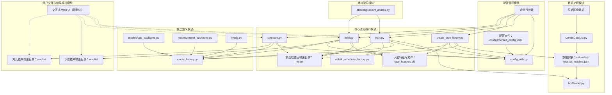

# 基于PaddlePaddle的人脸对比和人脸识别系统

> **重要提示**:
> * 训练和测试时的图像大小**必须保持一致**！模型加载时会优先使用模型文件中保存的图像大小。
> * **执行任何脚本前，请务必激活您的Python虚拟环境 (例如 `source paddle_env/bin/activate`)！**

本项目利用 [PaddlePaddle](https://www.paddlepaddle.org.cn/) 深度学习框架，构建了一套灵活且高效的人脸对比和人脸识别系统。系统支持多种骨干网络和损失函数的组合，并通过集中的 YAML 配置文件和命令行参数实现了高度的可配置性。

**最新成果**: 我们已成功实现了 **2种骨干网络 x 2种损失函数 x 5种学习率调度器的 20种组合的自动化正交训练测试**，为模型性能评估和优化提供了坚实基础。

## ✨ 功能特性 (Core Features)

* **灵活的模型组合**: 支持 VGG 和 ResNet 骨干网络，以及 CrossEntropy 和 ArcFace Loss。
* **集中的配置管理**: 所有参数通过 `configs/default_config.yaml` 文件统一管理。
* **命令行参数覆盖**: 支持通过命令行动态调整关键参数，方便实验。
* **自动化训练脚本**: 提供 `train.sh` 脚本，支持对多种模型配置进行批量自动化训练和测试。
* **高效的数据读取**: 基于 `MyReader.py` 实现自定义数据集加载和预处理。
* **训练断点恢复**: 支持从检查点恢复训练，节省时间和计算资源。
* **人脸特征提取、对比与识别**: 提供相应的脚本 (`create_face_library.py`, `compare.py`, `infer.py`) 实现核心人脸功能。
* **数据增强**: 训练时支持随机翻转、亮度对比度调整等数据增强策略，提高模型泛化能力。
* **云服务器自动训练**: 提供自动化训练脚本，支持在云服务器上持续训练和参数调整。
* **[规划中] 对抗攻击与防御**: 实现FGSM、PGD等对抗攻击方法，并集成对抗训练以增强模型鲁棒性。
* **[新增] 自动化正交训练测试**: 成功测试了 2种骨干网络× 2种损失组合× 5种学习率调度器的所有 20种正交组合的自动化训练流程。

## 🚀 快速上手 (Quick Start)

<details>
<summary>点击展开/折叠快速上手步骤</summary>

1.  **克隆仓库**:
    ```bash
    git clone https://github.com/Nahjs/Face-Recognition.git
    cd Face-Recognition
    ```
2.  **创建并激活Python虚拟环境** (推荐):
    ```bash
    python3 -m venv paddle_env
    # Linux/macOS:
    source paddle_env/bin/activate
    # Windows:
    # paddle_env\Scripts\activate
    ```
    **重要**: 后续所有 `python` 或 `pip` 命令都应在此激活的虚拟环境中执行。

3.  **安装依赖**:
    (推荐使用GPU版本以获得更好性能)
    ```bash
    # 确保 paddle_env 虚拟环境已激活
    # GPU 版本 (示例为CUDA 11.8, 请根据您的CUDA版本和PaddlePaddle官网查找对应安装命令)
    python -m pip install paddlepaddle-gpu==3.0.0 -i https://www.paddlepaddle.org.cn/packages/stable/cu118/
    pip uninstall numpy -y
    pip install numpy==1.26.4 PyYAML opencv-python==4.5.5.64 matplotlib==3.5.3 scikit-learn tqdm
    ```
    (如果无GPU或仅测试，可安装CPU版本)
    ```bash
    # CPU 版本
    # python -m pip install paddlepaddle==2.4.2 # CPU 版本可能也需要调整 numpy
    # pip uninstall numpy -y
    # pip install numpy==1.26.4 PyYAML opencv-python==4.5.5.64 matplotlib==3.5.3 scikit-learn tqdm
    ```
    详细的环境准备和依赖安装说明请参见 [⚠️ 重要环境准备](#️-重要环境准备) 部分。

4.  **准备数据与数据列表**:
    * 按照 [1. 准备数据](#1-准备数据) 的说明组织您的人脸图像数据。
    * 运行脚本生成数据列表：
        ```bash
        # 激活虚拟环境后执行
        # 为默认数据集 (data/face) 生成列表
        # (如果存在旧文件，先手动删除)
        # rm -f data/face/trainer.list data/face/test.list data/face/readme.json
        python CreateDataList.py data/face

        # 为自定义数据集 (例如 data/my_faces) 生成列表
        # python CreateDataList.py data/my_faces
        ```
    **重要**:
    * 在重新生成列表前，请**手动删除**目标目录下（如 `data/face` 或 `data/my_faces`）已存在的 `trainer.list`, `test.list`, 和 `readme.json` 文件。
    * `CreateDataList.py` 脚本的参数是**包含所有人物子文件夹的数据集根目录**。

5.  **修改配置**:
    * 打开 `configs/default_config.yaml`。
    * 根据您的数据集修改 `num_classes` (类别数量)。
    * 选择或自定义一个 `active_config` 块 (例如 `resnet_arcface_config`) 并按需调整其参数 (如 `learning_rate`, `epochs`, `batch_size` 等)。详情参阅 [⚙️ 配置管理](#️-配置管理)。
6.  **执行核心功能示例** (确保已激活虚拟环境):
    * **模型训练**:
        ```bash
        # 示例：训练配置文件中 active_config 指向的配置
        python train.py --config_path configs/default_config.yaml --use_gpu --source manual --class_name face
        # 示例：通过命令行指定活动配置块 (假设 resnet_arcface_steplr_config 已在YAML中定义)
        # python train.py --config_path configs/default_config.yaml --active_config resnet_arcface_steplr_config --use_gpu --source manual --class_name face
        ```
    * **创建人脸特征库** (如果使用ArcFace模型):
        ```bash
        # 确保 model_path 指向您训练好的ArcFace模型
        python create_face_library.py --config_path configs/default_config.yaml --model_path model/best_model_resnet_arcface_CosineAnnealingDecay_gpu_manual.pdparams --data_list_file data/face/trainer.list --use_gpu
        ```
    * **人脸识别**:
        ```bash
        # 确保 model_path 和 image_path 根据实际情况调整
        python infer.py --config_path configs/default_config.yaml --model_path model/best_model_resnet_arcface_CosineAnnealingDecay_gpu_manual.pdparams --image_path data/face/person1/1.jpg --use_gpu
        ```
    * **人脸对比**:
        ```bash
        # 确保 model_path 和图片路径根据实际情况调整
        python compare.py --config_path configs/default_config.yaml --model_path model/best_model_resnet_arcface_CosineAnnealingDecay_gpu_manual.pdparams --img1 data/face/person1/1.jpg --img2 data/face/person2/1.jpg --use_gpu
        ```

</details>

## 📄 目录

* [✨ 功能特性 (Core Features)](#-功能特性-core-features)
* [🚀 快速上手 (Quick Start)](#-快速上手-quick-start)
* [项目架构与技术栈](#项目架构与技术栈)
    * [模块依赖图 (概念)](#模块依赖图-概念)
    * [核心技术栈](#核心技术栈)
* [项目结构说明](#项目结构说明)
* [⚠️ 重要环境准备](#️-重要环境准备)
    * [1. 进入项目根目录](#1-进入项目根目录)
    * [2. 激活Python虚拟环境](#2-激活python虚拟环境)
    * [3. GPU用户环境变量设置](#3-gpu用户环境变量设置-重要)
    * [4. 安装依赖](#4-安装依赖-1)
* [⚙️ 配置管理](#️-配置管理)
    * [YAML配置文件概览 (`configs/default_config.yaml`)](#yaml配置文件概览-configsdefault_configyaml)
        * [全局设置 (`global_settings`)](#全局设置-global_settings)
        * [活动配置选择 (`active_config`)](#活动配置选择-active_config)
        * [具体配置块示例 (如 `resnet_arcface_config`)](#具体配置块示例-如-resnet_arcface_config)
        * [学习率调度器配置 (`lr_scheduler_type`, `lr_scheduler_params`)](#学习率调度器配置-lr_scheduler_type-lr_scheduler_params)
    * [命令行参数与覆盖规则](#命令行参数与覆盖规则)
    * [配置加载工具 (`config_utils.py`)](#配置加载工具-config_utilspy)
* [📖 详细使用指南](#-详细使用指南)
    * [1. 准备数据](#1-准备数据)
    * [2. 创建数据列表 (`CreateDataList.py`)](#2-创建数据列表-createdatalistpy)
    * [3. 模型训练 (`train.py`)](#3-模型训练-trainpy)
    * [4. 创建人脸特征库 (针对ArcFace模型, `create_face_library.py`)](#4-创建人脸特征库-针对arcface模型-create_face_librarypy)
    * [5. 人脸识别测试 (`infer.py`)](#5-人脸识别测试-inferpy)
    * [6. 人脸对比测试 (`compare.py`)](#6-人脸对比测试-comparepy)
    * [7. 更换数据集流程](#7-更换数据集流程)
* [📊 模型与实验 (Models and Experiments)](#-模型与实验-models-and-experiments)
    * [自动化正交训练测试](#自动化正交训练测试)
    * [模型可视化对比](#模型可视化对比)
* [🛠️ 模型调优指南](#️-模型调优指南)
    * [参数调整示例](#参数调整示例)
    * [可调参数概览](#可调参数概览)
* [🛡️ 验收与评估 (Acceptance and Evaluation)](#️-验收与评估-acceptance-and-evaluation)
    * [独立测试集](#独立测试集)
    * [验收界面](#验收界面)
* [💡 技术实现细节](#-技术实现细节)
* [🔮 下一步计划 (Future Plans)](#-下一步计划-future-plans)
    * [交互式Web应用与可视化](#1-交互式web应用与可视化)
    * [即时个性化识别](#2-即时个性化识别)
    * [对抗网络与鲁棒性增强](#3-对抗网络与鲁棒性增强)
    * [Optuna 超参数调优](#4-optuna-超参数调优)
    * [更多数据集集成与模型部署](#5-更多数据集集成与模型部署)
* [❓ 常见问题解决 (FAQ)](#-常见问题解决-faq)
* [📝 注意事项](#-注意事项)
* [🤝 贡献 (Contributing)](#-贡献-contributing)
* [📄 许可证 (License)](#-许可证-license)
* [🙏 致谢 (Acknowledgements)](#-致谢-acknowledgements)


## 项目架构与技术栈

### 模块依赖图（概念）



*(本图展示了本项目中各核心模块之间的依赖关系与数据流动，涵盖了数据预处理、模型训练、特征提取与识别推理等主要过程。)*

### 核心技术栈

*   **核心框架**: 本项目基于 PaddlePaddle 深度学习框架开发，并在 paddlepaddle-gpu==3.0.0 环境下测试通过。
*   **编程语言**: Python 3.8 及以上版本。
*   **主要依赖**:
    *   `PyYAML`: 用于解析YAML配置文件。
    *   `opencv-python`: 用于图像读取和预处理。
    *   `matplotlib`: 用于结果可视化。
    *   `scikit-learn`: (可能用于评估指标，或辅助数据处理)。
    *   `tqdm`: 用于显示进度条。
    *   `numpy`: 数值计算基础库。

## 项目结构说明

```

Face-Recognition/
├── attacks/                  # [新增/规划中] 对抗攻击实现模块
│   └── gradient_attacks.py   # FGSM, PGD等基于梯度的攻击
├── configs/                  # 配置目录
│   └── default_config.yaml   # 默认YAML配置文件 (包含多种预设模式及对抗训练配置)
├── data/                     # 数据目录 (示例: data/face)
│   └── face/                 # 示例人脸数据集 (可替换为 data/<config.class_name>)
│       ├── person1/
│       │   └── 1.jpg
│       │   └── ...
│       └── person2/
│           └── 1.jpg
│           └── ...
├── model/                    # 模型保存目录 (由配置文件中 model_save_dir 指定)
├── models/                   # 存放骨干网络、[规划中]GAN生成器/判别器等定义
│   ├── vgg_backbone.py       # VGG骨干网络定义
│   ├── resnet_backbone.py    # ResNet骨干网络定义
│   ├── generator_2d.py       # [规划中] 2D GAN 生成器
│   └── discriminator_2d.py   # [规划中] 2D GAN 判别器
├── heads.py                  # 存放模型头部定义 (如ArcFaceHead, CrossEntropyHead)
├── utils/                    # 存放工具/辅助模块
│   ├── lr_scheduler_factory.py # 学习率调度器工厂
│   └── visualization_utils.py  # [规划中] 可视化辅助脚本
├── results/                  # 推理和对比结果图片保存目录
├── CreateDataList.py         # 创建数据列表脚本
├── MyReader.py               # 图像读取和预处理模块
├── config_utils.py           # 配置加载与合并工具模块
├── train.py                  # 模型训练脚本 (将集成对抗训练逻辑)
├── create_face_library.py    # 创建人脸特征库脚本 (用于ArcFace模型推理)
├── infer.py                  # 人脸识别预测脚本 (将集成对抗测试)
├── compare.py                # 人脸对比工具脚本
├── train.sh                  # 自动化训练脚本 (用于本地或服务器批量训练)
├── evaluate_robustness.py    # [规划中] 评估模型在对抗样本上性能的脚本
└── README.md                 # 项目说明文档 (本文档)

```

## ⚠️ 重要环境准备
[(返回目录)](#-目录)

在开始之前，请确保您已完成以下环境设置：

### 1. 进入项目根目录
所有后续命令都应在克隆本仓库后的 `Face-Recognition` 目录下执行。
```bash
    cd path/to/Face-Recognition
```

### 2. 激活Python虚拟环境
本项目推荐使用名为 `paddle_env` 的虚拟环境。
```bash
# 如果是第一次，创建虚拟环境:
    # python3 -m venv paddle_env
    # Linux/macOS:
    source paddle_env/bin/activate
    # Windows:
    # paddle_env\Scripts\activate
```
**非常重要**: 每次执行项目中的 Python 脚本 (`train.py`, `infer.py` 等) 或 `pip install` 命令前，都请确保您已在当前终端会话中激活了此虚拟环境。

### 3. GPU用户环境变量设置 (重要)
如果您计划使用GPU进行训练或推理，请在您的终端会话中设置以下环境变量。将这些命令添加到您的 `~/.bashrc` 或 `~/.zshrc` 文件中可以使其永久生效。
```bash
# 根据您的CUDA实际安装路径调整
export CUDA_HOME=/usr/local/cuda
# 对于WSL用户，可能需要包含 /usr/lib/wsl/lib
export LD_LIBRARY_PATH=$LD_LIBRARY_PATH:$CUDA_HOME/lib64:/usr/lib/wsl/lib
```
运行 `source ~/.bashrc` (或对应的shell配置文件) 使更改生效。

### 4. 安装依赖
请参考 [🚀 快速上手 (Quick Start)](#-快速上手-quick-start)部分的依赖安装命令。确保在已激活的 `paddle_env` 虚拟环境中执行。

## ⚙️ 配置管理
[(返回目录)](#-目录)

本项目采用YAML文件 (`configs/default_config.yaml`) 结合命令行参数的方式进行配置管理，由 `config_utils.py` 模块实现加载和合并逻辑。

### YAML配置文件概览 (`configs/default_config.yaml`)
包含 `global_settings` (全局默认参数) 和多个特定配置块 (如 `resnet_arcface_config`)。通过 `active_config` 键指定当前要激活的配置块。

#### 全局设置 (`global_settings`)
适用于所有模式的基础配置，会被活动配置块中的同名参数覆盖。
```yaml
# configs/default_config.yaml (部分示例)
use_gpu: true
seed: 42
image_size: 64
data_dir: 'data'      # 数据集根目录
class_name: 'face'    # 当前使用的数据集子目录名 (位于 data_dir 下，例如 data/face)
model_save_dir: 'model'
num_classes: 5        # 重要: 必须根据实际数据集修改! (由CreateDataList.py生成的readme.json中的total_classes确定)
log_interval: 10
resume: null          # null: 检查点存在则自动恢复, true: 强制恢复, false: 强制不恢复

# 对抗训练相关配置 (若启用 adversarial_training: true)
adversarial_training: false
attack_method: 'pgd'  # 可选: 'fgsm', 'pgd'
# FGSM & PGD 攻击参数
epsilon: 0.03         # 最大扰动量 (通常在 [0,1] 标准化空间下)
# PGD 特定攻击参数
alpha: 0.007          # PGD迭代步长
num_iter: 10          # PGD迭代次数
```

#### 活动配置选择 (`active_config`)
修改此值以选择不同的预设配置块。
```yaml
active_config: 'resnet_arcface_CosineAnnealingDecay_config' # 示例，应与train.sh中或自定义的配置块名匹配
```
`train.sh` 脚本中定义了多种学习率调度器与骨干网络/损失的组合配置名，例如：
* `vgg_ce_steplr_config`
* `resnet_arcface_cosine_config` (此名称更规范，建议将旧的 `resnet_arcface_config` 重命名或作为基础模板)
* ...等等共20种组合。请确保 `default_config.yaml` 中有这些配置块的定义。

#### 具体配置块示例 (如 `resnet_arcface_cosine_config`)
定义特定模型、损失、超参数组合。
```yaml
resnet_arcface_cosine_config: # 名称应与 active_config 或 train.sh 中的一致
  model_type: 'resnet'
  loss_type: 'arcface'

  model: # 骨干网络参数
    resnet_params:
      feature_dim: 512
      nf: 32
      n_resnet_blocks: 3
  loss: # 损失函数/头部参数
    arcface_params:
      arcface_m1: 1.0
      arcface_m2: 0.5 # ArcFace margin
      arcface_m3: 0.0
      arcface_s: 64.0 # ArcFace scale

  # 训练超参数
batch_size: 32
  epochs: 120
  learning_rate: 0.001 # 初始学习率
  optimizer_type: 'AdamW'
  optimizer_params:
    weight_decay: 0.0001

  # 学习率调度器配置
  lr_scheduler_type: 'CosineAnnealingDecay' # 此配置块的核心特征
  lr_scheduler_params:
    cosine_annealing:
      T_max: 120 # 通常等于总epochs
      eta_min: 0.0
    warmup: # 可选的Warmup配置
      use_warmup: false
      warmup_steps: 500
      start_lr: 0.00001

  # 推理、对比、建库时的特定参数
  infer:
    face_library_path: 'model/face_library_resnet_arcface_cosine.pkl' # 建议与模型配置关联
    recognition_threshold: 0.5
    label_file: 'readme.json' # 文件名，实际路径会拼接 data_dir/class_name
    infer_visualize: true
  compare:
    compare_threshold: 0.8
    compare_visualize: true
  create_library:
    output_library_path: 'model/face_library_resnet_arcface_cosine.pkl' # 建议与模型配置关联
```

### 命令行参数与覆盖规则
*   `--config_path`: 指定YAML文件。
*   `--active_config`: 覆盖YAML中的 `active_config`。
*   `--use_gpu`/`--no-use_gpu`, `--resume`/`--no-resume`: 开关参数。
*   其他参数如 `--learning_rate`, `--batch_size`, `--class_name <name>` 等可直接覆盖YAML中的值。
*   **优先级**: 命令行参数 > 活动配置块 > 全局设置。

### 配置加载工具 (`config_utils.py`)
`load_config` 函数负责加载和合并所有配置源，返回一个可通过属性访问的 `ConfigObject` 对象。

## 📖 详细使用指南
**提醒：执行所有Python脚本前，请确保已激活 `paddle_env` 虚拟环境。**
[(返回目录)](#-目录)

### **1. 准备数据**
将人脸数据按以下结构存放 (假设 `config.data_dir` 为 `data`, `config.class_name` 为 `face`):
```
data/face/
├── person1/
│ ├── 1.jpg ...
├── person2/
│ ├── 1.jpg ...
└── ...
```

建议预先对人脸进行检测和裁剪，确保人脸区域清晰且大小适中。

### **2. 创建数据列表 (`CreateDataList.py`)**
此脚本遍历指定的数据集根目录，生成训练/测试列表和元数据文件。
```bash
# 示例: python CreateDataList.py data/face
# 该命令会在 data/face/ 目录下生成 trainer.list, test.list, readme.json
python CreateDataList.py <config.data_dir>/<config.class_name>
```
**重要**: `readme.json` 中的 `total_classes` 值必须与您在 `configs/default_config.yaml` 中为训练设置的 `num_classes` **保持一致**。

### **3. 模型训练 (`train.py`)**
负责执行模型的训练流程。
```bash
# 激活 paddle_env 环境后执行

# 示例1: 使用YAML中默认的 active_config 进行训练
python train.py --config_path configs/default_config.yaml --use_gpu --source manual --class_name face

# 示例2: 通过命令行指定一个在YAML中定义好的活动配置块 (如train.sh中使用的)
# 假设 resnet_arcface_cosine_config 是一个已定义的配置块名
python train.py --config_path configs/default_config.yaml --active_config resnet_arcface_cosine_config --use_gpu --resume --source manual --class_name face
```
*   `--source manual`: 标记为手动运行的训练（区别于`train.sh`中可能设置的`auto`）。
*   `--class_name face`: 明确指定使用 `data/face` 目录下的数据列表和 `readme.json`。如果更换数据集，此参数也需相应更改。
*   **对抗训练**: 如果在所选的活动配置块或全局设置中启用了 `adversarial_training: true` 并配置了相关攻击参数，训练脚本将自动进行对抗训练。评估阶段也会在对抗样本上进行测试（需要对应修改评估逻辑）。
*   训练日志、模型检查点 (`checkpoint_*.pdparams`) 和最佳模型 (`best_model_*.pdparams`) 会保存在 `config.model_save_dir` 指定的目录中，文件名会包含模型类型、损失类型、学习率调度器类型、硬件和来源等信息。

### **4. 创建人脸特征库 (针对ArcFace模型, `create_face_library.py`)**
如果模型使用 ArcFace Loss 训练，则需要创建特征库用于后续1:N识别。
```bash
# 激活 paddle_env 环境后执行
# --model_path 应指向训练好的ArcFace模型
# --data_list_file 通常是训练列表，用于提取已知身份的特征
# output_library_path 在配置文件中指定，例如 infer.face_library_path 或 create_library.output_library_path
python create_face_library.py \
    --config_path configs/default_config.yaml \
    --active_config resnet_arcface_cosine_config \
    --model_path model/best_model_resnet_arcface_CosineAnnealingDecay_gpu_manual.pdparams \
    --data_list_file data/face/trainer.list \
    --use_gpu
```
生成的 `.pkl` 特征库文件路径由配置文件中 `active_config` 下的 `create_library.output_library_path` (或 `infer.face_library_path`) 指定。

### **5. 人脸识别测试 (`infer.py`)**
对单张人脸图像进行身份识别。
```bash
# 激活 paddle_env 环境后执行
python infer.py \
    --config_path configs/default_config.yaml \
    --active_config resnet_arcface_cosine_config \
    --model_path model/best_model_resnet_arcface_CosineAnnealingDecay_gpu_manual.pdparams \
    --image_path data/face/person1/some_test_image.jpg \
    --use_gpu
```
*   ArcFace模型会将输入图像特征与特征库 (`infer.face_library_path` 指定) 比对。
*   CrossEntropy模型直接输出分类概率最高的身份。
*   **测试对抗样本**: （需修改`infer.py`）可增加参数 `--attack <method>` 来对输入图像生成对抗样本后再进行推理，以评估模型鲁棒性。

### **6. 人脸对比测试 (`compare.py`)**
对比两张人脸图像的相似度。
```bash
# 激活 paddle_env 环境后执行
python compare.py \
    --config_path configs/default_config.yaml \
    --active_config resnet_arcface_cosine_config \
    --model_path model/best_model_resnet_arcface_CosineAnnealingDecay_gpu_manual.pdparams \
    --img1 data/face/person1/img1.jpg \
    --img2 data/face/person1/img2.jpg \
    --use_gpu
```

### **7. 更换数据集流程**
1.  **准备新数据集**: 按 [1. 准备数据](#1-准备数据) 的规范组织图像，例如存放在 `data/my_new_dataset`。
2.  **创建数据列表**: 运行 `python CreateDataList.py data/my_new_dataset`。记下生成的 `readme.json` 中的 `total_classes`。
3.  **配置YAML文件**:
    *   建议复制 `configs/default_config.yaml` 为例如 `configs/my_new_dataset_config.yaml` (或在默认文件中新增配置块)。
    *   修改配置：
        *   更新 `active_config` 指向新配置块。
        *   在全局或活动配置块中，更新 `class_name: 'my_new_dataset'`。
        *   **非常重要**: 更新 `num_classes` 为新数据集的实际类别总数。
        *   (可选) 为新模型指定新的 `model_save_dir`。
        *   更新 `infer`, `compare`, `create_library` 配置块中相关的 `label_file` (应为 `readme.json`) 和特征库路径，使其指向新数据集的相关文件和期望路径 (例如，`face_library_path: 'model/face_library_my_new_dataset.pkl'`)。
4.  **开始新数据集训练**:
    ```bash
    # 激活 paddle_env 环境后执行
    python train.py --config_path configs/my_new_dataset_config.yaml --active_config <your_new_config_block> --use_gpu --source manual --class_name my_new_dataset
    ```

## 📊 模型与实验 (Models and Experiments)
[(返回目录)](#-目录)

### 自动化正交训练测试
本项目通过 `train.sh` 脚本实现了对 4种骨干网络/损失函数组合 (VGG+CE, VGG+ArcFace, ResNet+CE, ResNet+ArcFace) 与 5种学习率调度器 (StepDecay, MultiStepDecay, CosineAnnealingDecay, ReduceOnPlateau, CosineAnnealingWarmRestarts) 的共20种模型配置进行自动化批量训练和测试。

*   **脚本**: `train.sh` (请根据您的环境调整其中的 `PROJECT_DIR`, `VENV_PATH` 等)。
*   **配置**: `train.sh` 中的 `CONFIG_NAMES_TO_TRAIN` 数组定义了要训练的配置块名称，这些名称必须在 `configs/default_config.yaml` 中有对应的配置块定义。每个配置块通常指定了骨干网络、损失类型、学习率调度器类型及其参数。
*   **日志**: 每个训练组合的日志会分别保存在 `train.sh` 中 `LOG_DIR` 指定的目录下，方便追踪和分析。文件名通常包含配置名、硬件和时间戳。
*   **输出**: 训练完成后，每个配置会生成对应的 `checkpoint_*.pdparams` 和 `best_model_*.pdparams` 文件，以及相应的 `.json` 元数据文件，记录了训练的详细信息和最终性能。
*   **观察与结论**: （此处应根据您的实际测试结果填写，例如：在LFW验证集子集上，ResNet50+ArcFace结合CosineAnnealingDecay（预热5轮）在100轮训练后达到了XX.X%的准确率，而VGG16+CrossEntropy则为YY.Y%。观察到ReduceLROnPlateau在某些情况下收敛较慢等。）

这一自动化测试为模型选择和超参数调整提供了坚实的数据基础。

### 模型可视化对比
为了更直观地分析和比较不同模型的训练动态和最终性能，建议采用以下可视化方法：

*   **训练/验证曲线**:
    *   损失曲线 (Loss vs. Epochs/Steps): 对比不同模型在训练集和验证集上的损失下降速度和最终收敛值。
    *   准确率曲线 (Accuracy vs. Epochs/Steps): 对比不同模型在训练集和验证集上的准确率变化情况和最终性能。
*   **学习率变化曲线** (Learning Rate vs. Epochs/Steps):
    *   对于使用了不同学习率调度器的模型，可视化学习率的实际变化过程。
*   **关键指标对比图**:
    *   柱状图/雷达图: 对比所有模型在最终验证集上的准确率、平均损失等。
*   **工具**:
    *   **Matplotlib/Seaborn**: 训练结束后，编写Python脚本读取 `train.py` 输出的日志文件或保存的元数据（.json文件），生成对比图表。
    *   **VisualDL (PaddlePaddle)**: 在 `train.py` 中集成 `paddle.callbacks.VisualDL`，可以在训练过程中实时监控各项指标，并方便地在VisualDL界面对比多次不同运行（不同模型）的曲线。
    *   **交互式Web应用**: (详见 [🔮 下一步计划 (Future Plans)](#-下一步计划-future-plans))

## 🛠️ 模型调优指南
[(返回目录)](#-目录)
通过修改 `configs/default_config.yaml` 中的参数或通过命令行覆盖进行实验。

### 参数调整示例
修改 `learning_rate` 并指定一个特定的配置块进行训练：
```bash
# 激活 paddle_env 环境后执行
python train.py --config_path configs/default_config.yaml --active_config resnet_arcface_cosine_config --learning_rate 0.0005 --use_gpu --class_name face
```

### 可调参数概览
*   **通用训练参数**: `learning_rate`, `batch_size`, `epochs`, `optimizer_type` (AdamW, Momentum), `optimizer_params.weight_decay`, `lr_scheduler_type` 及 `lr_scheduler_params` (各种调度器的特定参数，如 `T_max`, `eta_min`, `patience`, `factor`等)。
*   **模型结构参数**:
    *   `model_type`: 'vgg' 或 'resnet'。
    *   `model.resnet_params`: `feature_dim` (输出特征维度), `nf` (初始通道数), `n_resnet_blocks` (深度)。
    *   `model.vgg_params`: `dropout_rate`。
*   **损失函数参数** (主要针对ArcFace):
    *   `loss.arcface_params`: `arcface_s` (scale), `arcface_m2` (margin)。
*   **数据相关**: `image_size`，数据增强策略 (目前在 `MyReader.py` 中定义，未来可配置化)。
*   **对抗训练参数** (如果启用): `epsilon`, `alpha`, `num_iter`。

进行调优时，建议采用控制变量法，并详细记录实验结果。

## 🛡️ 验收与评估 (Acceptance and Evaluation)
[(返回目录)](#-目录)

### 独立测试集
采用与训练集和验证集（即`train.py`中`test_loader`使用的数据）完全独立的测试集进行最终的模型性能评估，以获得无偏结果。

*   **创建**: 从总数据中预留一部分作为最终验收测试集，例如 `data/acceptance_test_set/`。使用 `CreateDataList.py data/acceptance_test_set` 生成其独立的列表文件 `acceptance_test.list` 和 `readme.json`。
*   **评估脚本**: 可以创建一个新的评估脚本 `evaluate_on_acceptance_set.py` (可基于 `infer.py` 的逻辑进行修改)。该脚本应：
    1.  加载最终选定的最佳模型 (例如 `best_model_*.pdparams`)。
    2.  读取验收测试集的列表文件。
    3.  遍历列表中的图片，执行人脸识别（1:N对比特征库）或分类。
    4.  计算标准评估指标，如Top-1/Top-5准确率（分类任务），或人脸验证的TAR@FAR（如果实现1:1验证逻辑）。
    5.  输出最终性能报告。
*   **执行示例**:
```bash
    # 激活 paddle_env 环境后执行
    python evaluate_on_acceptance_set.py --config_path <指向包含模型信息的配置文件> --model_path <最终模型路径> --acceptance_data_list data/acceptance_test_set/acceptance_test.list --acceptance_label_file data/acceptance_test_set/readme.json [--use_gpu]
```

### 验收界面
为了方便直观地展示模型效果和进行用户验收，可以开发一个简单的用户界面。

*   **功能**:
    *   上传单张图片进行人脸识别（显示预测身份和置信度/相似度）。
    *   上传两张图片进行人脸对比（显示相似度和是否同一人判断）。
*   **实现技术推荐**:
    *   **Streamlit / Gradio**: Python库，可以非常快速地为机器学习模型创建交互式Web应用界面，代码量少，非常适合快速原型和演示。**强烈推荐优先考虑！**
    *   **Flask/FastAPI + 前端 (HTML/JS/CSS)**: 更灵活，但开发周期更长。后端提供API接口，前端负责展示。

(更多关于交互式界面的想法见 [🔮 下一步计划 (Future Plans)](#-下一步计划-future-plans))

## 💡 技术实现细节
[(返回目录)](#-目录)

*   **骨干网络**: `models/vgg_backbone.py`, `models/resnet_backbone.py` 定义了VGG和ResNet的变体。
*   **模型头部与损失函数**: `heads.py` 中封装了如 `ArcFaceHead` (利用 `paddle.nn.functional.margin_cross_entropy`) 和 `CrossEntropyHead` (标准线性分类头+交叉熵损失)。
*   **模型组装工厂**: `model_factory.py` 中的 `get_backbone` 和 `get_head` 根据配置动态创建骨干网络和头部模块实例。
*   **配置系统**: `config_utils.py` 中的 `load_config` 负责加载和合并来自YAML文件和命令行参数的配置，生成易于访问的 `ConfigObject`。
*   **数据处理与加载**: `CreateDataList.py` 生成训练/测试列表和元数据文件 (`readme.json`)。`MyReader.py` 实现 `paddle.io.Dataset` 和 `DataLoader`，负责图像读取、预处理（包括缩放、标准化）和数据增强。
*   **学习率调度**: `utils/lr_scheduler_factory.py` 根据配置创建学习率调度器实例，支持多种策略和Warmup。
*   **模型持久化**: 模型和检查点以字典形式通过 `paddle.save` 保存，包含模型权重 (`backbone`, `head`)、优化器状态、学习率调度器状态、当前epoch、最佳准确率以及完整的训练配置 (`config`)快照。同时保存 `.json` 元数据文件记录训练详情。
*   **[规划中] 对抗攻击**: `attacks/gradient_attacks.py` 将实现FGSM, PGD等攻击。
*   **[规划中] 对抗训练**: `train.py` 将集成对抗样本生成逻辑，在训练步骤中使用对抗样本或混合样本进行训练。

## 🔮 下一步计划 (Future Plans)
[(返回目录)](#-目录)

### 1. 交互式Web应用与可视化
*   **目标**: 开发一个交互式Web应用界面，用于：
*   **高级训练过程可视化**:
    *   展示训练过程中的损失、准确率、学习率等多种曲线。
    *   支持曲线动态切换与分组: 用户可以自定义组合筛选条件（如骨干网络、损失函数、学习策略、硬件平台GPU/CPU、训练来源自动/手动等）来对比不同模型或训练运行的表现。
*   **模型交互式验收**:
    *   用户通过界面上传图片进行实时的人脸识别（显示身份及置信度/相似度）和人脸对比。
*   **（进阶）Web端训练与参数调整**:
    *   允许用户在Web界面上选择模型配置、调整关键超参数，并远程启动/监控训练任务。
    *   这需要一个更强大的后端来管理任务队列、资源调度和实时日志反馈。可以先从生成配置文件或命令行开始，逐步过渡到完全的Web控制。
*   **技术选型思考**:
    *   快速原型/内部工具: Streamlit 或 Gradio (Python)。
    *   更定制化/生产级应用: Flask/FastAPI (Python后端) + React/Vue/Plotly.js (前端)。

### 2. 即时个性化识别
*   **目标**: 实现用户可以使用自己的照片快速训练（或更新模型），使系统能够立即识别出该用户。
*   **实现路径**:
    *   **数据便捷上传**: 提供简单的用户照片上传和管理界面。
    *   **特征库动态更新 (针对ArcFace类模型)**:
        *   提取新用户照片的特征向量。
        *   将新特征（或其平均值）添加到现有的人脸特征库 (`.pkl`文件) 中。
        *   这种方式无需重新训练整个模型，响应速度快。
    *   **模型微调 (Fine-tuning)**:
        *   对于CrossEntropy模型，或当需要更高精度/新用户数据较多时。
        *   在原有预训练模型的基础上，使用包含新用户的数据集进行少量轮次的微调。`train.py` 的断点续训和学习率调整功能可支持此操作。

### 3. 对抗网络与鲁棒性增强
*   **目标**: 研究和实现常见的对抗攻击方法，评估模型在这些攻击下的脆弱性，并应用对抗训练等防御策略来提升模型的鲁棒性。
*   **行动计划**:
    *   **环境准备**: 确保 PaddlePaddle 环境就绪。
    *   **创建攻击模块 (`attacks/`)**:
        *   在项目根目录下创建 `attacks/` 文件夹。
        *   创建 `attacks/gradient_attacks.py` 文件。实现 `fgsm_attack` 和 `pgd_attack` 函数。
        *   **核心**: 攻击函数需要接收模型（或一个能从输入图像计算到最终损失的函数）、原始图像、真实标签和攻击参数（如 `epsilon`）。它们会计算损失对于输入图像的梯度，并据此生成对抗扰动。
        *   **模型调用**: 需适配您项目中从图像到损失的计算方式。例如，可以传递一个 lambda 函数：`loss_fn_for_attack = lambda model, imgs, lbls: model.head(model.backbone(imgs), lbls)[0]` （假设head返回 `loss, acc_output`）。
        *   **像素值范围**: 确保对抗样本生成过程中的 `clip` 操作（限制像素值范围）与您数据预处理后的图像范围一致（例如，如果预处理后是标准化数据，则clip范围可能不是[0,1]，或者在攻击前/后进行适当的(逆)标准化）。
    *   **（可选）实现2D GAN生成对抗扰动**:
        *   在 `models/` 目录下创建 `generator_2d.py` 和 `discriminator_2d.py`。
        *   生成器应为编码器-解码器结构，输入原始图像，输出微小扰动。判别器则区分原始图像和添加了生成扰动的图像。
    *   **修改训练脚本 (`train.py`) 以集成对抗训练**:
        *   在 `configs/default_config.yaml` 的全局设置或活动配置块中添加对抗训练相关的配置项（已在上方示例中给出）。
        *   `train.py` 中加载这些配置。
        *   在训练循环的每个batch中，如果启用了对抗训练 (`config.adversarial_training is True`):
            *   获取当前batch的原始图像 `x` 和标签 `y`。
            *   调用实现的攻击函数（如 `pgd_attack(model_fn_for_attack, x, y, config.epsilon, config.alpha, config.num_iter)`）生成对抗样本 `x_adv`。
            *   使用对抗样本 (`x_adv, y`) 来计算损失（通过 `head_module_instance(backbone_instance(x_adv), y)`）并进行反向传播和参数更新。
            *   （可选）可以采用混合训练策略，例如，一半的step用原始样本，一半用对抗样本，或者将对抗损失作为正则项加入总损失。
    *   **训练过程中监控鲁棒性**:
        *   在每个epoch结束后的评估阶段，除了在原始测试集上评估模型准确率，还应在对抗测试集上评估模型的准确率。对抗测试集可以通过对原始测试集样本应用PGD等攻击方法动态生成。这将直观地展示对抗训练是否有效提升了模型的鲁棒性。
    *   **修改评估/推理脚本 (`infer.py` 或创建新的 `evaluate_robustness.py`)**:
        *   添加功能：加载已训练模型，读取单张或多张测试图片。
        *   调用攻击函数生成这些图片的对抗样本。
        *   用模型分别对原始图片和对抗样本进行推理，对比预测结果。
        *   计算指标：如攻击成功率（模型对原始样本预测正确，但对相应对抗样本预测错误的比率）、在对抗样本上的准确率。
        *   可视化：添加功能以并列展示原始人脸图像、计算出的扰动（可能需要放大以便观察）、以及最终的对抗样本图像。
    *   **更新文档 (`README.md`)**:
        *   在本文档中（例如，在“功能特性”或创建一个新的专门章节“对抗鲁棒性研究”）详细说明已实现的对抗攻击方法、对抗训练策略。
        *   解释如何配置和运行相关脚本（如何生成对抗样本，如何进行对抗训练，如何评估鲁棒性）。
        *   总结实验结果和观察到的现象。

### 4. Optuna 超参数调优
*   按原计划，利用 Optuna 框架对表现较好的模型组合（例如，通过自动化正交测试筛选出的顶尖配置）进行更细致和系统的超参数搜索与优化，目标是进一步提升模型性能。
*   **调优参数范围**: 学习率、批大小、权重衰减、ResNet的 `nf` 和 `n_resnet_blocks`、ArcFace的 `s` 和 `m2` 等。
*   **实施**: 开发Optuna集成脚本，该脚本会调用 `train.py` 并传入不同的超参数组合，然后基于验证集性能（如最高准确率或最低损失）来指导Optuna的搜索。

### 5. 更多数据集集成与模型部署
*   **数据集**: 考虑在更广泛、更具挑战性的人脸数据集（如CASIA-WebFace的子集、MS-Celeb-1M的子集，注意数据使用规范）上训练和评估模型，以提升泛化能力。
*   **模型部署**: 研究将训练好的PaddlePaddle模型转换为Paddle Inference格式（用于服务器端高效推理）或ONNX格式（用于跨平台部署，如移动端或边缘设备）。探索使用Paddle Serving或Paddle Lite进行服务化部署或端侧部署。

## ❓ 常见问题解决 (FAQ)
[(返回目录)](#-目录)

*   **环境与安装问题**:
    *   `paddlepaddle` 安装失败或版本冲突: 查阅官网，确保Python/CUDA版本匹配。
    *   `numpy` ABI 错误: 尝试 `pip uninstall numpy -y && pip install numpy==1.26.4`。
    *   `ImportError: libcudart.so.X.X`: 检查 `CUDA_HOME` 和 `LD_LIBRARY_PATH`。
*   **数据准备问题**:
    *   `CreateDataList.py` 未生成列表或 `readme.json` 不符合预期: 检查数据集目录结构和图片。
    *   训练时找不到图片: 检查 `data_dir`, `class_name` 配置及列表文件中的路径。
*   **训练过程问题**:
    *   不收敛，Loss不降/上升: 学习率过高？数据问题？ArcFace参数不当？
    *   GPU显存不足 (OOM): 减小 `batch_size` 或 `image_size`，或使用更轻量模型。
    *   过拟合: 增加数据/增强，加大正则化 (`weight_decay`)，Early Stopping (手动观察)。
*   **ArcFace 相关问题**:
    *   特征库生成不准确: 确保模型已正确训练。
    *   推理时都识别为"未知": 特征库问题？阈值过高？
*   **图像大小不一致错误**: 确保训练、建库、推理、对比各阶段 `image_size` 一致。模型文件会保存训练时的 `image_size` 并优先使用。

*(详细内容请参考原FAQ部分，并根据实际遇到的问题持续更新)*

## 📝 注意事项
[(返回目录)](#-目录)

1.  **时刻激活虚拟环境!** 在执行任何 `python` 或 `pip` 命令前，确保已 `source paddle_env/bin/activate`。
2.  确保配置文件 (`configs/default_config.yaml`) 中的 `num_classes` 与您数据集（由 `CreateDataList.py` 生成的 `readme.json` 中的 `total_classes` 定义）的实际类别总数匹配。
3.  训练、所有后续操作（推理、对比、建库）中使用的 `image_size` 必须保持一致。脚本会优先使用模型文件中保存的 `image_size`。
4.  ArcFace模型进行推理前，必须先使用 `create_face_library.py` 针对该模型和目标身份数据生成特征库。
5.  所有脚本的路径参数（如模型路径、数据列表路径、图像路径）默认是相对于项目根目录的。
6.  定期清理 `results/` 和 `model/` 目录中不再需要的旧文件，以节省空间。
7.  当修改 `configs/default_config.yaml` 后，如果 `train.sh` 正在后台运行，可能需要重启脚本以加载最新配置（除非脚本内部有重载逻辑）。

## 🤝 贡献 (Contributing)
[(返回目录)](#-目录)
欢迎对本项目感兴趣的开发者提交 Pull Request 或报告 Issue。

## 📄 许可证 (License)
[(返回目录)](#-目录)
本项目采用 [MIT] 许可证 (或其他您选择的许可证)。

## 🙏 致谢 (Acknowledgements)
[(返回目录)](#-目录)

*   感谢 PaddlePaddle 深度学习框架及其社区提供的强大支持。
*   感谢 OpenCV 图像处理库。
*   感谢 Matplotlib 绘图库。
*   感谢 PyYAML, scikit-learn, tqdm, numpy 等开源库。
*   感谢所有在人脸识别领域做出贡献的研究者和开源项目。